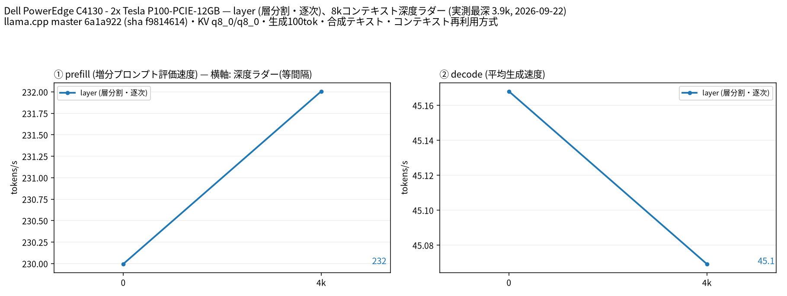

# Tesla P100 2 枚で Qwen3.6 35B の layer 分割を測定

- **作成者**: jin
- **作成日**: 2026-09-22

## 概要

Dell PowerEdge C4130 の Tesla P100-PCIE-12GB 2枚で Qwen3.6-35B-A3B-UD-Q4_K_M を layer 分割し、スモークテストを実施した。
decode は浅い位置で45.17 tokens/s、目標深度4,000（実際3,917）で45.07 tokens/sだった。
各段100トークン・1回の短い測定であり、tensor 分割との比較や本番の長時間測定は実施していない。

## ハードウェア

| 項目 | 内容 |
|------|------|
| コンピュータ / マザーボード | Dell PowerEdge C4130 / Dell 0VCHW8 |
| GPU | 測定対象 Tesla P100-PCIE-12GB × 2（VRAM 12 GiB / 枚） |
| GPU 接続 | 測定後の確認では2枚とも PCIe 3.0 x8。NVLink の有無は未確認 |
| CPU | Intel Xeon E5-2637 v3 @ 3.50GHz × 2（合計8コア / 16スレッド） |
| メモリ | OS 認識約15.04 GiB、種類は不明 |

GPU 枚数は今回の測定対象を示す。前回の起動失敗時は PCIe 上に3枚存在したが、今回の測定時の物理搭載枚数は再確認していない。

## ソフトウェア環境

| 項目 | 内容 |
|------|------|
| OS | Ubuntu 26.04.1 LTS / Linux 7.0.0-31-generic |
| GPU ドライバ | NVIDIA 580.173.02 |
| llama.cpp | 0.4.0-dev、build 1、commit 6a1a922d269908a29cbd4b49c27e6a8e7fd10fae、CUDA |
| llama-server SHA-256 | f981461497a3acb6e9cb970847b4a01c581f790b4f740f185f26957dfc8c0661 |

## ベンチマーク

### 条件

| 項目 | 内容 |
|------|------|
| ツール | llama-split-bench commit 7af72d4085aa5073677d41389144112dd94fcb74 |
| モデル | Qwen3.6-35B-A3B-UD-Q4_K_M.gguf、22,134,528,992 bytes（約20.61 GiB） |
| 測定モード | layer、CUDA0,CUDA1 |
| ctx / stages | 8192 / 0,4000 |
| 各段の生成長 / 回数 | 100 tokens / 1回 |
| 新規プロンプト長 | 目標512,2048 tokens（実際512,1978） |
| KV キャッシュ | K=q8_0 / V=q8_0 |
| 投機的デコード | なし |
| GPU オフロード / Flash Attention | 全レイヤー指定 / on |
| CPU スレッド / batch / ubatch | 8 / 256 / 128 |
| 実プロンプト補正 | 無効（--no-real） |
| 実行時刻 | 2026-09-22 13:01:34〜13:04:24 UTC（読み込み等を含む） |

常駐の qwen36.service を停止して測定し、終了後に再起動した。
前回の失敗したスモークテストと今回の `argv-layer.txt` が完全に一致することを確認した。
測定コマンドは以下のとおり（事前にローカル設定でモデルとバイナリを指定）。

```bash
bash run-bench.sh jin-qwen36-smoke-20260922-retry2 \
  --stages 0,4000 --n-predict 100 --ctx 8192 \
  --pp0-sizes 512,2048 --modes layer --no-real
```

### 結果



深度ラダーの結果（単位: tokens/s）。

| 目標深度 | 実際の深度 | prefill | decode |
|----------|------------|---------|--------|
| 0 | 11 | — | 45.17 |
| 4,000 | 3,917 | 232.01 | 45.07 |

初段の prefill は11トークンによる計測上のアーティファクトのため掲載していない。
深度0の新規プロンプト prefill は別測定の以下の値を参照する。ラダーの4,000段では `cache_n=0` であり、キャッシュ再利用は観測されなかった。

| 新規プロンプト目標長 | 実測プロンプト長 | prefill（tokens/s） |
|--------------------|------------------|---------------------|
| 512 | 512 | 223.32 |
| 2,048 | 1,978 | 229.99 |

### 所感

今回の短い測定では、浅い位置と約4,000トークン位置の decode はともに約45 tokens/sだった。
100トークンを1回生成した結果のため、小さな速度差を性能差と断定しない。単一 GPU や tensor 分割、長いコンテキストに対する優劣は未評価である。

測定自体は完了したが、実行時の Python に matplotlib がなく、自動作図の段階だけ `BENCH-FIGFAIL` となった。
その後、作業用仮想環境に matplotlib を導入し、保存済み JSON から同ツールで日本語・英語の図を生成した。再測定や測定値の補正は行っていない。

## 添付

- [日本語の図](attachment/2026-09-22_130424_benchmarking_qwen3_6_35b_on_2x_tesla_p100/split-bench-ja.png)
- [英語の図](attachment/2026-09-22_130424_benchmarking_qwen3_6_35b_on_2x_tesla_p100/split-bench-en.png)
- [深度ラダーの結果](attachment/2026-09-22_130424_benchmarking_qwen3_6_35b_on_2x_tesla_p100/results-layer.json)
- [新規プロンプトの結果](attachment/2026-09-22_130424_benchmarking_qwen3_6_35b_on_2x_tesla_p100/results-layer-pp0.json)
- [実行情報](attachment/2026-09-22_130424_benchmarking_qwen3_6_35b_on_2x_tesla_p100/run-info.json)
- [サーバ起動引数](attachment/2026-09-22_130424_benchmarking_qwen3_6_35b_on_2x_tesla_p100/argv-layer.txt)

添付コピー内のホームディレクトリは `~/` に置換した。元の実行記録はローカルに保持している。起動引数を再利用する場合は、モデルとバイナリのパスを実行環境に合わせて指定する。
