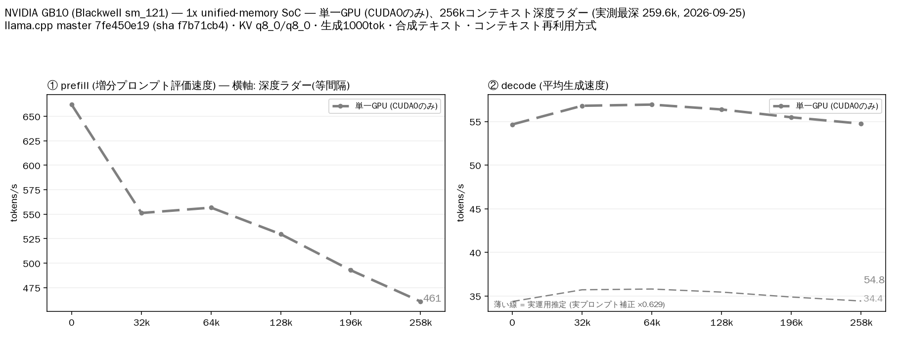

# NVIDIA GB10（統合メモリ SoC）単体で Qwen3.8 Flash Next（MoE）を 262k コンテキストまで計測

- **作成者**: 0rangaxx
- **作成日**: 2026-09-25

## 概要

Lenovo の Thinkstation PGX (DGX Spark互換機) NVIDIA GB10（Grace Blackwell、Arm CPU + GPU が統合メモリを共有する SoC）単体で、Qwen3.8 Flash Next（512 エキスパートの MoE、GGUF 80 GiB）を 262k コンテキストまで計測しました。
GPU と RAM が同一メモリプールのため、モデル重みの CPU オフロードが不要です。
結果は prefill 461〜557 t/s、decode 約 55〜57 t/s（MTP 投機的デコードあり）を 258k までほぼ一定に維持しました。
実プロンプトでは MTP の受理率が下がり decode は 32〜36 t/s です（補正係数 0.63）。

## ハードウェア

| 項目 | 内容 |
|------|------|
| コンピュータ / マザーボード | Lenovo Thinkstation PGX（型番 30KLS01900）— NVIDIA GB10 (Grace Blackwell) SoC 搭載。`/sys/class/dmi/id/product_name` = `30KLS01900`、`board_name` は `INVALID` |
| GPU | NVIDIA GB10（統合メモリ SoC）。nvidia-smi の VRAM は `[N/A]` で、システム RAM と同一プールを共有する。離散 VRAM ではない |
| GPU 接続 | SoC 内蔵（nvidia-smi は PCIe Gen1 x1 を報告）。NVLink なし |
| CPU | Arm aarch64、20 コア（Cortex-X925 + Cortex-A725 の構成。`lscpu` で両モデル名を確認） |
| メモリ | 統合メモリ 128 GiB（`free -h` で 121 GiB 表示）。種類は不明 |
| 電源 | 不明 |

## ソフトウェア環境

| 項目 | 内容 |
|------|------|
| OS | Ubuntu 24.04.4 LTS / Linux 6.17.0-1026-nvidia |
| GPU ドライバ | 580.159.03（CUDA 13.0） |
| llama.cpp | 0.5.0（`7fe450e19`）に [`llama-v0.5.0-clean-20260924.patch`](https://huggingface.co/pentacoxian-dev/Qwen3.8-Flash-Next-IQ3E-Q8D-MTP-GGUF/blob/d3de0ef2487c3f48846cc8beffef44a36929e7b2/patches/llama-v0.5.0-clean-20260924.patch) を当てたもの。`qwen4exp` 対応・MTP 投機的デコードを含む。CUDA バックエンド（`CMAKE_CUDA_ARCHITECTURES=121`、GB10 = sm_121）。バイナリの sha256 `f7b71cb4…` は run-info.json に記録 |

## ベンチマーク

### 条件

| 項目 | 内容 |
|------|------|
| ツール | llama-split-bench `7af72d4`（ローカル変更なし） |
| モデル | Qwen3.8-Flash-Next-IQ3E-Q8D-MTP.gguf（[pentacoxian-dev/Qwen3.8-Flash-Next-IQ3E-Q8D-MTP-GGUF](https://huggingface.co/pentacoxian-dev/Qwen3.8-Flash-Next-IQ3E-Q8D-MTP-GGUF)、80.0 GiB。アーキテクチャ `qwen4exp`、512 エキスパート中 10 個がアクティブ。ルーティングされるエキスパートは UD-IQ3_XXS、密なテンソルと MTP ヘッドは Q8_0） |
| 測定モード | single（CUDA0 のみ）。GPU が 1 つのため layer / tensor は計測していません |
| ctx / stages | 262144 / 0,32000,64000,128000,196000,258000 |
| KV キャッシュ | q8_0 / q8_0 |
| 投機的デコード | `--spec-type draft-mtp --spec-draft-n-max 3` |
| その他 | `-fa on`、`-ngl all`、`--fit on --fit-target 512`、`-t 8 -tb 48`、`--batch-size 2048 --ubatch-size 512`、`--load-mode mmap`、`--reasoning off`、生成 1000 トークン / 段（全引数は argv-single.txt） |

### 結果

depth ごとの prefill / decode（t/s）。depth 0 の prefill は新規プロンプト（pp2048）の値です。ラダー初段（11 トークン）の prefill は表に載せていません。

| depth | prefill (t/s) | decode (t/s) | MTP 受理率 |
|------:|------:|------:|------:|
| 0 | 662.0 | 54.7 | 92.6% |
| 32k | 551.3 | 56.8 | 97.4% |
| 64k | 556.7 | 56.9 | 97.1% |
| 128k | 529.6 | 56.4 | 97.6% |
| 196k | 492.8 | 55.5 | 97.1% |
| 258k | 460.9 | 54.8 | 97.4% |

depth 0 の新規プロンプト prefill（t/s）:

| プロンプト長 | single (t/s) |
|------:|------:|
| 512 | 596.8 |
| 1978 | 662.0 |
| 8077 | 624.1 |

実プロンプト（3 種、temp 0.7 / top_p 0.9、1200 トークン生成）の decode は 32.5〜36.4 t/s、受理率 43〜54% で、ラダー depth 0 の合成テキストに対する補正係数は **0.63** です（図の薄い破線）。

| プロンプト | decode (t/s) | MTP 受理率 |
|------|------:|------:|
| design | 36.4 | 54% |
| review | 32.5 | 43% |
| qa | 34.2 | 44% |

### 所感

- **統合メモリの GB10 単体で、80 GiB の MoE を CPU オフロードなしに 262k まで回せた**。decode は 32k〜258k で 55〜57 t/s とほぼ一定、prefill も 64k の 557 t/s から 258k の 461 t/s へ約 17% 低下するだけで安定しています。
- decode は MTP の受理率に強く依存します。合成テキスト（受理率約 97%）では約 56 t/s ですが、実プロンプトでは受理率 43〜54% で 32〜36 t/s に落ちます。
- pentacoxian 氏の V100-SXM2-32GB × 2（layer 分割）の prefill 615〜738 / decode 約 98〜103 と比べると、本機は prefill でやや遅く、decode はその約半分です。ただし本機は**離散 GPU 1 つ・統合メモリ**という構成であり、2 枚の VRAM を合わせた帯域とは条件が異なります。
- nvidia-smi は SoC のため VRAM を `[N/A]` と返し、PCIe も Gen1 x1 を報告します。計測中の GPU 温度は 45〜69℃、消費電力は 26〜32 W（nvidia-smi の値）と低く、統合メモリ帯域がボトルネックになる領域ではなさそうです。
- DGX互換機の強みは実質VRAM量と消費電力・冷却音の小ささにあると思います

## 添付

- [run-info.json](attachment/2026-09-25_171942_qwen3_8_flash_next_single_gpu_on_nvidia_gb10/run-info.json)
- [results-single.json](attachment/2026-09-25_171942_qwen3_8_flash_next_single_gpu_on_nvidia_gb10/results-single.json) / [results-single-pp0.json](attachment/2026-09-25_171942_qwen3_8_flash_next_single_gpu_on_nvidia_gb10/results-single-pp0.json)
- [results-real.json](attachment/2026-09-25_171942_qwen3_8_flash_next_single_gpu_on_nvidia_gb10/results-real.json)
- [argv-single.txt](attachment/2026-09-25_171942_qwen3_8_flash_next_single_gpu_on_nvidia_gb10/argv-single.txt)
- [split-bench-en.png](attachment/2026-09-25_171942_qwen3_8_flash_next_single_gpu_on_nvidia_gb10/split-bench-en.png)
