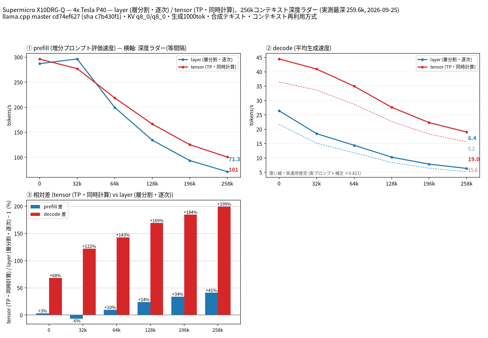
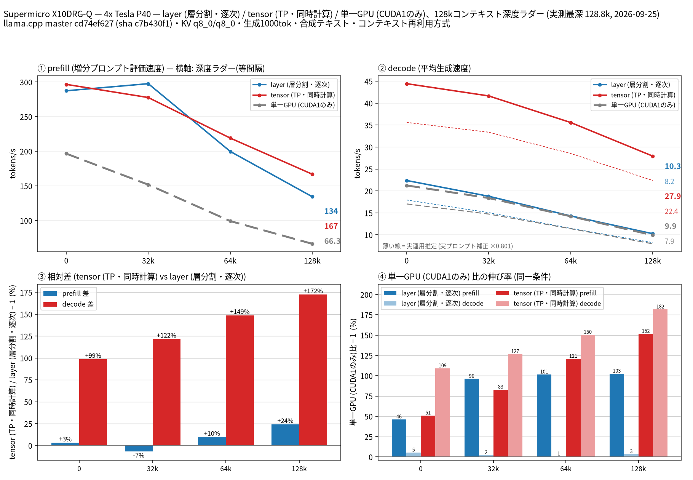

# Tesla P40 4 枚で Qwen3.8 27B の split-mode を比較（単一 GPU ベースライン付き）

- **作成者**: 0kqnet
- **作成日**: 2026-09-25

## 概要

Supermicro X10DRG-Q（2 ソケット）に載せた Tesla P40 × 4 で、Qwen3.8 27B UD-Q4_K_XL（MTP 投機的デコード付き）の `--split-mode layer` と `tensor` を比較しました。262k コンテキストでの本計測に加え、単一 GPU が収まる 131k コンテキストで single / layer / tensor の 3 構成も測りました。
decode は全深度で tensor が勝ち、262k の最深段（258k）では layer の 3.0 倍（19.0 対 6.35 t/s）でした。layer の decode は単一 GPU とほぼ同じで、layer 分割で得られるのは速度ではなく VRAM でした。
GPU は電源容量（1000 W）の都合で **1 枚あたり 150 W に電力制限**しています（P40 の標準は 250 W）。また、**GPU0 のみ PCIe x8 接続**です。

## ハードウェア

| 項目 | 内容 |
|------|------|
| コンピュータ / マザーボード | Supermicro X10DRG-Q |
| GPU | Tesla P40 × 4（VRAM 24 GB / 枚） |
| GPU 接続 | PCIe 3.0。GPU0 のみ x8、GPU1〜3 は x16。GPU0・1 が CPU0 側、GPU2・3 が CPU1 側（`nvidia-smi topo -m` で同じ側は PHB、反対側は SYS）。NVLink なし |
| CPU | Intel Xeon E5-2697A v4 × 2（16 コア / 32 スレッド × 2） |
| メモリ | 128 GB DDR4（速度は不明） |
| 電源 | 1000 W。これに合わせて GPU の電力上限を 150 W / 枚に設定（`nvidia-smi -pl 150`） |

## ソフトウェア環境

| 項目 | 内容 |
|------|------|
| OS | Ubuntu 26.04.1 LTS / Linux 7.0.0-34-generic |
| GPU ドライバ | 580.178.04 |
| llama.cpp | build 11179（commit cd74ef627、2026-09-25）、CUDA バックエンド（CUDA 12.4、`CMAKE_CUDA_ARCHITECTURES=61`、ホストコンパイラ g++-13）。NCCL なし |

## ベンチマーク

### 条件

| 項目 | 内容 |
|------|------|
| ツール | llama-split-bench 7af72d4 |
| モデル | Qwen3.8-27B-UD-Q4_K_XL（unsloth/Qwen3.8-27B-GGUF、17,559,178,144 バイト）＋ MTP ヘッド mtp-Qwen3.8-27B-Q4_0（同リポジトリの `MTP/`、1,369,590,656 バイト） |
| 測定モード | 262k: layer / tensor（いずれも CUDA0〜3 の 4 枚） 131k: 上記 2 つ ＋ single（CUDA1 のみ。GPU0 が x8 のため x16 の CUDA1 を選択） |
| ctx / stages | 262k: 262144 / 0,32000,64000,128000,196000,258000 131k: 131072 / 0,32000,64000,128000 |
| KV キャッシュ | q8_0 / q8_0 |
| 投機的デコード | `--spec-type draft-mtp -md <MTP ヘッド> --spec-draft-n-max 2` |

single は 262k では起動できませんでした。KV キャッシュの確保（約 8.7 GB）で out of memory になります。131k では起動でき、VRAM 使用量は 23.2 / 24.6 GB でした。

### 結果（262k: layer / tensor）

単位は t/s です。depth 0 の prefill は 2048 トークンの新規プロンプトの値です。

| depth | prefill layer | prefill tensor | decode layer | decode tensor |
|------:|------:|------:|------:|------:|
| 0 | 286.8 | 295.9 | 26.4 | 44.5 |
| 32k | 296.3 | 277.1 | 18.5 | 41.0 |
| 64k | 199.5 | 218.6 | 14.4 | 35.0 |
| 128k | 134.3 | 166.4 | 10.3 | 27.6 |
| 196k | 93.5 | 125.2 | 7.8 | 22.3 |
| 258k | 71.3 | 100.6 | 6.35 | 19.0 |

新規プロンプトの prefill（depth 0）:

| プロンプト長 | layer | tensor |
|------:|------:|------:|
| 512 | 194.1 | 277.5 |
| 2048 | 286.8 | 295.9 |
| 8192 | 343.5 | 301.0 |

### 結果（131k: single / layer / tensor）

| depth | prefill single | prefill layer | prefill tensor | decode single | decode layer | decode tensor |
|------:|------:|------:|------:|------:|------:|------:|
| 0 | 196.6 | 287.4 | 296.6 | 21.3 | 22.4 | 44.4 |
| 32k | 151.7 | 297.6 | 277.6 | 18.4 | 18.8 | 41.6 |
| 64k | 99.1 | 199.7 | 219.0 | 14.2 | 14.3 | 35.6 |
| 128k | 66.3 | 134.3 | 166.9 | 9.9 | 10.3 | 27.9 |

新規プロンプトの prefill（depth 0）:

| プロンプト長 | single | layer | tensor |
|------:|------:|------:|------:|
| 512 | 191.8 | 194.6 | 276.7 |
| 2048 | 196.6 | 287.4 | 296.6 |
| 8192 | 188.3 | 344.2 | 301.8 |

### 所感

- **decode は全深度で tensor が勝ちます**。layer との差は 262k の実行で depth 0 の +68% から 258k の +199% まで、深いほど広がりました。GPU 間の通信がソケットをまたぐ（SYS）構成ですが、tensor が有利でした。
- **layer の decode は単一 GPU とほぼ同じです**（131k の実行で +1〜5%）。tensor は単一 GPU の 2.1 倍（depth 0）〜2.8 倍（128k）でした。
- **prefill** は 32k だけ tensor が layer より 6〜7% 遅く、それ以外は tensor が同等以上です。258k では +41% でした。単一 GPU に対しては layer・tensor とも 1.5〜2.5 倍です。新規プロンプトの 8192 トークンだけは layer（約 344 t/s）が tensor（約 301 t/s）を上回りました。
- **MTP の採択率**:
  - ラダーの合成テキストでは 0.97〜1.0 でした。例外として、131k の実行の depth 0 は layer・single とも 0.73 でした。
  - 131k の layer の depth 0 の decode（22.4 t/s）が 262k の実行（26.4 t/s）より低いのは、この採択率の差によるものです。
  - 32k 以降の値は、2 回の実行の間で ±2% 以内に収まりました。
- **実運用の推定**:
  - 実プロンプト 3 本（tensor で実行）で測った採択率は、262k の実行で 0.57〜0.73、131k の実行で 0.50〜0.82 でした。
  - これから求めた補正係数は 262k の実行で 0.821、131k の実行で 0.801 です。
  - 図では、この係数を掛けた値を破線の「実運用推定」として示しています。262k の実行の 258k では layer 5.2 t/s、tensor 15.6 t/s です。
- **参考: Tesla P100 × 4 との比較**（[miminashi さんのレポート](2026-09-20_033840_comparing_split_modes_of_qwen3.8_27b_on_4x_tesla_p100.md)。同じモデル・MTP・ctx の組み合わせ）:
  - layer の prefill はほぼ同じです（258k で 71.3 対 71.8 t/s）。
  - layer の decode は、浅いところでは P40 が上で、深いところでは P100 が上です（258k で 6.35 対 9.7 t/s）。
  - tensor は prefill・decode とも全体に P100 が速いです（decode は 258k で 19.0 対 23.9 t/s）。
  - llama.cpp のビルドや CPU が異なり、P40 は 150 W に制限しているので、GPU だけの差とは言えません。
- 電源の都合で GPU を 150 W に制限しています。計測中は電力制限によるクロック抑制（SW Power Cap）がかかっていたので、250 W なら数値は変わる可能性があります。
- GPU0 のみ PCIe x8 接続です。tensor 分割は GPU 間の通信が多いので、この影響を受けている可能性があります。

## 添付

262k の実行（layer / tensor）:

- [run-info.json](attachment/2026-09-25_222946_comparing_split_modes_of_qwen3.8_27b_on_4x_tesla_p40_with_single_gpu_baseline/ctx262k/run-info.json)
- [results-layer.json](attachment/2026-09-25_222946_comparing_split_modes_of_qwen3.8_27b_on_4x_tesla_p40_with_single_gpu_baseline/ctx262k/results-layer.json) / [results-tensor.json](attachment/2026-09-25_222946_comparing_split_modes_of_qwen3.8_27b_on_4x_tesla_p40_with_single_gpu_baseline/ctx262k/results-tensor.json)
- [results-layer-pp0.json](attachment/2026-09-25_222946_comparing_split_modes_of_qwen3.8_27b_on_4x_tesla_p40_with_single_gpu_baseline/ctx262k/results-layer-pp0.json) / [results-tensor-pp0.json](attachment/2026-09-25_222946_comparing_split_modes_of_qwen3.8_27b_on_4x_tesla_p40_with_single_gpu_baseline/ctx262k/results-tensor-pp0.json)
- [results-real.json](attachment/2026-09-25_222946_comparing_split_modes_of_qwen3.8_27b_on_4x_tesla_p40_with_single_gpu_baseline/ctx262k/results-real.json)
- [argv-layer.txt](attachment/2026-09-25_222946_comparing_split_modes_of_qwen3.8_27b_on_4x_tesla_p40_with_single_gpu_baseline/ctx262k/argv-layer.txt) / [argv-tensor.txt](attachment/2026-09-25_222946_comparing_split_modes_of_qwen3.8_27b_on_4x_tesla_p40_with_single_gpu_baseline/ctx262k/argv-tensor.txt)
- [split-bench-en.png](attachment/2026-09-25_222946_comparing_split_modes_of_qwen3.8_27b_on_4x_tesla_p40_with_single_gpu_baseline/ctx262k/split-bench-en.png)

131k の実行（single / layer / tensor）:

- [run-info.json](attachment/2026-09-25_222946_comparing_split_modes_of_qwen3.8_27b_on_4x_tesla_p40_with_single_gpu_baseline/ctx131k/run-info.json)
- [results-single.json](attachment/2026-09-25_222946_comparing_split_modes_of_qwen3.8_27b_on_4x_tesla_p40_with_single_gpu_baseline/ctx131k/results-single.json) / [results-layer.json](attachment/2026-09-25_222946_comparing_split_modes_of_qwen3.8_27b_on_4x_tesla_p40_with_single_gpu_baseline/ctx131k/results-layer.json) / [results-tensor.json](attachment/2026-09-25_222946_comparing_split_modes_of_qwen3.8_27b_on_4x_tesla_p40_with_single_gpu_baseline/ctx131k/results-tensor.json)
- [results-single-pp0.json](attachment/2026-09-25_222946_comparing_split_modes_of_qwen3.8_27b_on_4x_tesla_p40_with_single_gpu_baseline/ctx131k/results-single-pp0.json) / [results-layer-pp0.json](attachment/2026-09-25_222946_comparing_split_modes_of_qwen3.8_27b_on_4x_tesla_p40_with_single_gpu_baseline/ctx131k/results-layer-pp0.json) / [results-tensor-pp0.json](attachment/2026-09-25_222946_comparing_split_modes_of_qwen3.8_27b_on_4x_tesla_p40_with_single_gpu_baseline/ctx131k/results-tensor-pp0.json)
- [results-real.json](attachment/2026-09-25_222946_comparing_split_modes_of_qwen3.8_27b_on_4x_tesla_p40_with_single_gpu_baseline/ctx131k/results-real.json)
- [argv-single.txt](attachment/2026-09-25_222946_comparing_split_modes_of_qwen3.8_27b_on_4x_tesla_p40_with_single_gpu_baseline/ctx131k/argv-single.txt) / [argv-layer.txt](attachment/2026-09-25_222946_comparing_split_modes_of_qwen3.8_27b_on_4x_tesla_p40_with_single_gpu_baseline/ctx131k/argv-layer.txt) / [argv-tensor.txt](attachment/2026-09-25_222946_comparing_split_modes_of_qwen3.8_27b_on_4x_tesla_p40_with_single_gpu_baseline/ctx131k/argv-tensor.txt)
- [split-bench-en.png](attachment/2026-09-25_222946_comparing_split_modes_of_qwen3.8_27b_on_4x_tesla_p40_with_single_gpu_baseline/ctx131k/split-bench-en.png)

添付の `run-info.json` と `argv-*.txt` では、ホームディレクトリのパスを `~/` に置き換えています。
