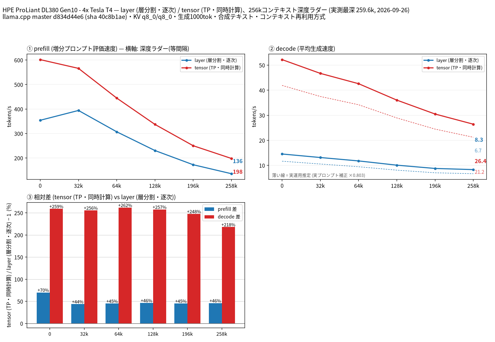
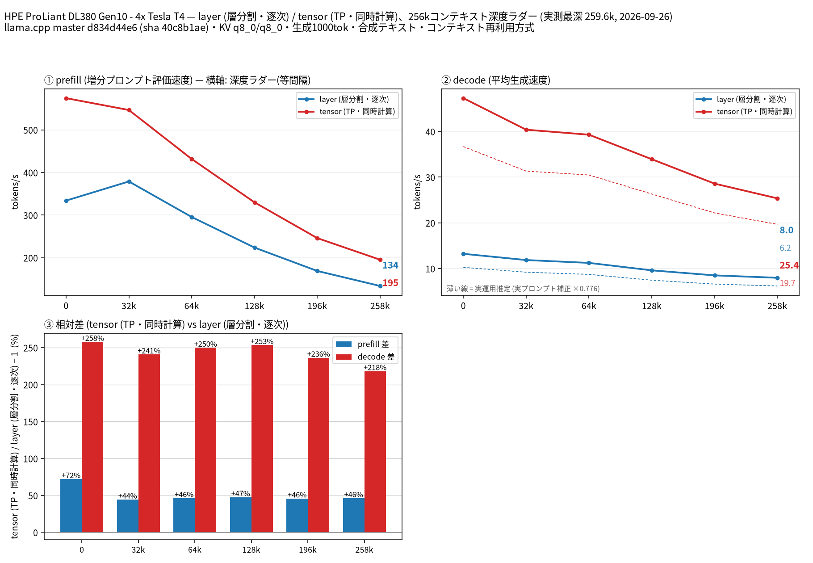
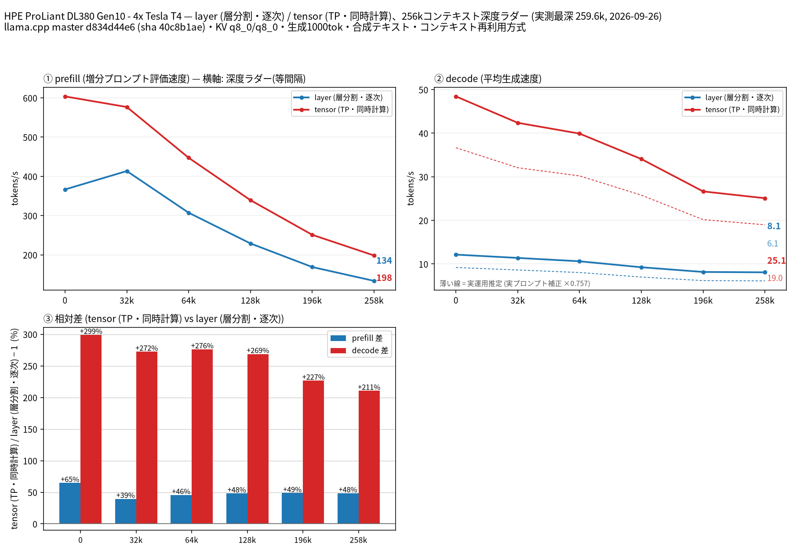

# Tesla T4 4 枚で Qwen3.8 27B の split-mode と量子化を比較

- **作成者**: MG8853
- **作成日**: 2026-09-26

## 概要

HPE ProLiant DL380 Gen10 に Tesla T4 × 4（15 GB / 枚）を載せた構成で、Qwen3.8 27B の `--split-mode layer` と `tensor`（TP=4）を 262k コンテキストまで比較しました。量子化は Unsloth の UD-Q4_K_XL / UD-Q6_K / Q8_0 の 3 種で、いずれも MTP 投機的デコードを有効にしています。
decode は 3 量子化すべてで tensor が全深度で圧勝し、258k では layer 8.1〜8.3 t/s に対して tensor 25.1〜26.4 t/s（約 3.2 倍）でした。prefill も tensor が全深度で 1.4〜1.5 倍速く、T4 4 枚では layer 分割を選ぶ理由が見つかりませんでした。
一方、量子化 3 種の速度差は小さく、262k（tensor）の decode は Q4_K_XL 26.44 / Q6_K 25.36 / Q8_0 25.08 t/s と 5% 以内に収まりました。VRAM に余裕があるなら Q8_0 を選んでも速度の犠牲はほとんどありません。

## ハードウェア

| 項目 | 内容 |
|------|------|
| コンピュータ / マザーボード | HPE ProLiant DL380 Gen10 |
| GPU | Tesla T4 × 4（VRAM 15,360 MiB / 枚、電力上限 70 W / 枚） |
| GPU 接続 | PCIe 3.0 x16（`nvidia-smi` の current はアイドル時 Gen1 x16、max / 実測時は Gen3 x16）。NVLink なし。`nvidia-smi topo -m` では GPU0-GPU1 が NODE、GPU2-GPU3 が NODE、この 2 組の間は SYS（NUMA ノードをまたぐ） |
| CPU | Intel Xeon Gold 6254 × 2（18 コア / 36 スレッド × 2。この環境でオンラインなのは 36 論理 CPU） |
| メモリ | 232 GiB |
| 電源 | 不明 |

## ソフトウェア環境

| 項目 | 内容 |
|------|------|
| OS | Ubuntu 26.04.1 LTS / Linux 7.0.14-14-pve |
| GPU ドライバ | 595.91.07（CUDA 13.2） |
| llama.cpp | master d834d44e6（version 0.5.0-dev build 11195、2026-09-26）、CUDA バックエンド（CUDA 13.2、`CMAKE_CUDA_ARCHITECTURES=75`、`GGML_CUDA_FA=ON`、`GGML_CUDA_FA_ALL_QUANTS=ON`、`GGML_CUDA_NCCL=ON`、Release / Ninja / GCC 15.2.0）。NCCL 2.30.4 がリンクされています（`ldd build/bin/libggml-cuda.so` に `libnccl.so.2`）。計測前にこのビルドへ更新しており、以前のビルド（build 10837 / 5202104b5）は使っていません |

## ベンチマーク

### 条件

| 項目 | 内容 |
|------|------|
| ツール | llama-split-bench 7af72d4 |
| モデル | Qwen3.8-27B の UD-Q4_K_XL / UD-Q6_K / Q8_0（unsloth/Qwen3.8-27B-GGUF、17,559,178,144 / 21,983,677,344 / 28,595,763,648 バイト） |
| 測定モード | layer / tensor（いずれも CUDA0〜CUDA3 の 4 枚）。モデルが T4 1 枚（15 GB）に収まらないため、単一 GPU の計測はしていません（図の第 4 パネルも無効化） |
| ctx / stages | 262144 / 0,32000,64000,128000,196000,258000 |
| KV キャッシュ | q8_0 / q8_0 |
| 投機的デコード | UD-Q4_K_XL / UD-Q6_K はモデル内蔵の MTP ヘッドを使い `--spec-type draft-mtp --spec-draft-n-max 2`。Q8_0 は nextn 層を含まない（テンソル数 851 対 866）ため、同リポジトリの MTP ヘッド mtp-Qwen3.8-27B-Q4_0（1,369,590,656 バイト）を `-md` で指定し、3 量子化すべてで投機的デコード有効の条件を揃えました |
| その他 | `-fa on`、`-ngl all`、`-t 8`、`--parallel 1`、`--jinja`、`--cache-ram 8192 --cache-idle-slots --cache-reuse 256`（`--cache-reuse` はこのビルドでは未対応のため無効化される）、生成 1000 トークン / 段、PORT 18081、`LAUNCH_PREFIX` なし |

### 結果（Qwen3.8-27B-UD-Q4_K_XL、17.6 GB）

単位は t/s です。depth 0 の prefill は新規プロンプト（pp2048）の値です。ラダー初段（11 トークン）の prefill は計測上のアーティファクトなので表に載せていません。

| depth | prefill layer | prefill tensor | decode layer | decode tensor |
|------:|------:|------:|------:|------:|
| 0 | 354.0 | 601.8 | 14.54 | 52.20 |
| 32k | 394.1 | 566.1 | 13.14 | 46.71 |
| 64k | 307.0 | 444.7 | 11.78 | 42.60 |
| 128k | 230.4 | 337.1 | 10.08 | 36.04 |
| 196k | 172.4 | 250.1 | 8.77 | 30.49 |
| 258k | 135.7 | 198.1 | 8.32 | 26.44 |

### 結果（Qwen3.8-27B-UD-Q6_K、22.0 GB）

| depth | prefill layer | prefill tensor | decode layer | decode tensor |
|------:|------:|------:|------:|------:|
| 0 | 333.9 | 574.3 | 13.22 | 47.29 |
| 32k | 378.9 | 546.5 | 11.85 | 40.38 |
| 64k | 295.5 | 431.6 | 11.23 | 39.29 |
| 128k | 223.8 | 330.0 | 9.60 | 33.93 |
| 196k | 168.9 | 246.0 | 8.50 | 28.58 |
| 258k | 133.7 | 195.3 | 7.97 | 25.36 |

### 結果（Qwen3.8-27B-Q8_0、28.6 GB）

| depth | prefill layer | prefill tensor | decode layer | decode tensor |
|------:|------:|------:|------:|------:|
| 0 | 366.6 | 603.7 | 12.13 | 48.43 |
| 32k | 413.5 | 576.7 | 11.38 | 42.38 |
| 64k | 307.3 | 447.3 | 10.61 | 39.90 |
| 128k | 229.0 | 339.3 | 9.24 | 34.06 |
| 196k | 168.8 | 251.0 | 8.16 | 26.64 |
| 258k | 133.6 | 198.3 | 8.07 | 25.08 |

### 量子化の比較

depth 0 の新規プロンプト prefill（t/s。括弧内は実トークン数）:

| プロンプト長 | Q4_K_XL layer | Q4_K_XL tensor | Q6_K layer | Q6_K tensor | Q8_0 layer | Q8_0 tensor |
|------:|------:|------:|------:|------:|------:|------:|
| 512 | 221.2 | 530.1 | 214.6 | 505.0 | 238.7 | 527.4 |
| 1978 | 354.0 | 601.8 | 333.9 | 574.3 | 366.6 | 603.7 |
| 8077 | 448.7 | 638.1 | 424.8 | 612.5 | 467.3 | 641.7 |

実プロンプト（tensor、3 種、1200 トークン生成）の MTP 採択率と decode、およびそこから求めた補正係数（図の薄い破線）:

| 量子化 | MTP 採択率 | 実プロンプト decode（t/s） | 補正係数 |
|--------|------|------|------|
| Q4_K_XL | 0.544〜0.755 | 38.3〜46.0 | 0.803 |
| Q6_K | 0.512〜0.736 | 33.2〜40.5 | 0.776 |
| Q8_0 | 0.569〜0.626 | 35.9〜37.1 | 0.757 |

計測中に記録された VRAM 確保量（MiB）:

| 量子化 | layer（CUDA0 / CUDA1 / CUDA2 / CUDA3） | tensor（各枚） |
|--------|------|------|
| Q4_K_XL | 8161 / 8227 / 8469 / 11775 | 8495 × 4 |
| Q6_K | 9225 / 9117 / 9473 / 12725 | 9471 × 4 |
| Q8_0 | 11149 / 10753 / 10753 / 14673 | 11159 × 4 |

### 所感

- **decode は 3 量子化すべてで tensor が全深度で圧勝しました**。差は 258k で +211〜+218%、depth 0 で +299%（Q8_0）〜+262%（Q4_K_XL）です。4 枚に分散したTPでは各段の GEMM が小さくなるため逐次パイプラインの layer 分割が不利で、T4 の 1 枚あたりの演算性能が低いことが差を大きくしていると考えられます（未検証）。
- **prefill も tensor が全深度で 1.4〜1.5 倍速い**という結果でした。2×V100 のレポートでは prefill は layer が速いので、これは 4 枚構成かつ T4 という条件によるものと思われます。特に GPU0-1 と GPU2-3 が NUMA ノードをまたぐ（SYS）構成でも tensor が勝っており、T4 4 枚では layer 分割を選ぶ積極的な理由は見つかりませんでした。
- **量子化 3 種の速度差は小さい**結果です。tensor の decode は 258k で Q4_K_XL 26.44 / Q6_K 25.36 / Q8_0 25.08 t/s（Q8_0 が Q4_K_XL 比 -5%）、depth 0 でも -7% に収まりました。prefill は 258k で 3 種とも 195〜198 t/s、32k では Q8_0（576.7）が Q4_K_XL（566.1）をわずかに上回っています。重みのバイト数が 63% 違っても速度がほぼ同じなのは、TP=4 では 1 ステップあたりの重み読み出しが 4 分の 1 になり、AllReduce などの通信や KV キャッシュ読み出しが支配的になっているためではないかと考えています（未検証）。
- **VRAM は 3 種すべて 4 枚で足りました**。Q8_0（28.6 GB）でも 262k コンテキスト（q8_0 KV）で 10.9〜14.3 GiB / 枚です。なお layer 分割の確保量は不均等（最後のカードが最大）で、合計は tensor より多くなりました（Q4_K_XL で 35.8 対 33.2 GiB 相当）。
- **MTP の採択率**: ラダーの合成テキストでは 3 量子化とも 0.94〜1.0（大半が 0.98 以上）でした。実プロンプト 3 本では 0.51〜0.76 で、補正係数は Q4_K_XL 0.803 / Q6_K 0.776 / Q8_0 0.757 です。Q8_0 だけ別配布の Q4_0 MTP ヘッドを使っているため、採択率の差にはヘッドの量子化の違いも含まれます。
- 計測中の **GPU 最高温度は 82℃**（Q4_K_XL layer、GPU0）でした。電力上限は既定の 70 W / 枚のままですが、サンプラ（2 秒間隔）には 70 W を超える瞬間値（最大約 122 W）が記録されています。温度ガードは作動しませんでした。
- 3 量子化 × 2 モードの計測は 05:59 から 08:41 まで（約 2 時間 42 分）かかりました。
- この環境のカーネルは Proxmox VE 系（7.0.14-14-pve）で、GPU は `nvidia-smi` から通常の T4 として見えています。仮想化の有無が速度に与える影響は確認していません。
- 参考として、同モデル（UD-Q4_K_XL）を 4 枚で測った他環境の 258k の値と比べると、tensor の decode は T4 26.4 t/s、[Tesla P100 × 4 のレポート](2026-09-20_033840_comparing_split_modes_of_qwen3.8_27b_on_4x_tesla_p100.md) 23.9 t/s、[Tesla P40 × 4 のレポート](2026-09-25_222946_comparing_split_modes_of_qwen3.8_27b_on_4x_tesla_p40_with_single_gpu_baseline.md) 19.0 t/s（電力上限 150 W）でした。layer の decode は T4 8.3 / P100 9.7 / P40 6.35 t/s です。llama.cpp のビルド・CPU・MTP ヘッドの出所が異なるため、GPU だけの比較ではありません。

## 添付

Q4_K_XL（17.6 GB、モデル内蔵 MTP）:

- [run-info.json](attachment/2026-09-26_084514_comparing_split_modes_and_quantizations_of_qwen3.8_27b_on_4x_tesla_t4/q4_k_xl/run-info.json)
- [results-layer.json](attachment/2026-09-26_084514_comparing_split_modes_and_quantizations_of_qwen3.8_27b_on_4x_tesla_t4/q4_k_xl/results-layer.json) / [results-tensor.json](attachment/2026-09-26_084514_comparing_split_modes_and_quantizations_of_qwen3.8_27b_on_4x_tesla_t4/q4_k_xl/results-tensor.json)
- [results-layer-pp0.json](attachment/2026-09-26_084514_comparing_split_modes_and_quantizations_of_qwen3.8_27b_on_4x_tesla_t4/q4_k_xl/results-layer-pp0.json) / [results-tensor-pp0.json](attachment/2026-09-26_084514_comparing_split_modes_and_quantizations_of_qwen3.8_27b_on_4x_tesla_t4/q4_k_xl/results-tensor-pp0.json)
- [results-real.json](attachment/2026-09-26_084514_comparing_split_modes_and_quantizations_of_qwen3.8_27b_on_4x_tesla_t4/q4_k_xl/results-real.json)
- [argv-layer.txt](attachment/2026-09-26_084514_comparing_split_modes_and_quantizations_of_qwen3.8_27b_on_4x_tesla_t4/q4_k_xl/argv-layer.txt) / [argv-tensor.txt](attachment/2026-09-26_084514_comparing_split_modes_and_quantizations_of_qwen3.8_27b_on_4x_tesla_t4/q4_k_xl/argv-tensor.txt)
- [split-bench-en.png](attachment/2026-09-26_084514_comparing_split_modes_and_quantizations_of_qwen3.8_27b_on_4x_tesla_t4/q4_k_xl/split-bench-en.png)

Q6_K（22.0 GB、モデル内蔵 MTP）:

- [run-info.json](attachment/2026-09-26_084514_comparing_split_modes_and_quantizations_of_qwen3.8_27b_on_4x_tesla_t4/q6_k/run-info.json)
- [results-layer.json](attachment/2026-09-26_084514_comparing_split_modes_and_quantizations_of_qwen3.8_27b_on_4x_tesla_t4/q6_k/results-layer.json) / [results-tensor.json](attachment/2026-09-26_084514_comparing_split_modes_and_quantizations_of_qwen3.8_27b_on_4x_tesla_t4/q6_k/results-tensor.json)
- [results-layer-pp0.json](attachment/2026-09-26_084514_comparing_split_modes_and_quantizations_of_qwen3.8_27b_on_4x_tesla_t4/q6_k/results-layer-pp0.json) / [results-tensor-pp0.json](attachment/2026-09-26_084514_comparing_split_modes_and_quantizations_of_qwen3.8_27b_on_4x_tesla_t4/q6_k/results-tensor-pp0.json)
- [results-real.json](attachment/2026-09-26_084514_comparing_split_modes_and_quantizations_of_qwen3.8_27b_on_4x_tesla_t4/q6_k/results-real.json)
- [argv-layer.txt](attachment/2026-09-26_084514_comparing_split_modes_and_quantizations_of_qwen3.8_27b_on_4x_tesla_t4/q6_k/argv-layer.txt) / [argv-tensor.txt](attachment/2026-09-26_084514_comparing_split_modes_and_quantizations_of_qwen3.8_27b_on_4x_tesla_t4/q6_k/argv-tensor.txt)
- [split-bench-en.png](attachment/2026-09-26_084514_comparing_split_modes_and_quantizations_of_qwen3.8_27b_on_4x_tesla_t4/q6_k/split-bench-en.png)

Q8_0（28.6 GB、外部 MTP ヘッド mtp-Qwen3.8-27B-Q4_0）:

- [run-info.json](attachment/2026-09-26_084514_comparing_split_modes_and_quantizations_of_qwen3.8_27b_on_4x_tesla_t4/q8_0/run-info.json)
- [results-layer.json](attachment/2026-09-26_084514_comparing_split_modes_and_quantizations_of_qwen3.8_27b_on_4x_tesla_t4/q8_0/results-layer.json) / [results-tensor.json](attachment/2026-09-26_084514_comparing_split_modes_and_quantizations_of_qwen3.8_27b_on_4x_tesla_t4/q8_0/results-tensor.json)
- [results-layer-pp0.json](attachment/2026-09-26_084514_comparing_split_modes_and_quantizations_of_qwen3.8_27b_on_4x_tesla_t4/q8_0/results-layer-pp0.json) / [results-tensor-pp0.json](attachment/2026-09-26_084514_comparing_split_modes_and_quantizations_of_qwen3.8_27b_on_4x_tesla_t4/q8_0/results-tensor-pp0.json)
- [results-real.json](attachment/2026-09-26_084514_comparing_split_modes_and_quantizations_of_qwen3.8_27b_on_4x_tesla_t4/q8_0/results-real.json)
- [argv-layer.txt](attachment/2026-09-26_084514_comparing_split_modes_and_quantizations_of_qwen3.8_27b_on_4x_tesla_t4/q8_0/argv-layer.txt) / [argv-tensor.txt](attachment/2026-09-26_084514_comparing_split_modes_and_quantizations_of_qwen3.8_27b_on_4x_tesla_t4/q8_0/argv-tensor.txt)
- [split-bench-en.png](attachment/2026-09-26_084514_comparing_split_modes_and_quantizations_of_qwen3.8_27b_on_4x_tesla_t4/q8_0/split-bench-en.png)

