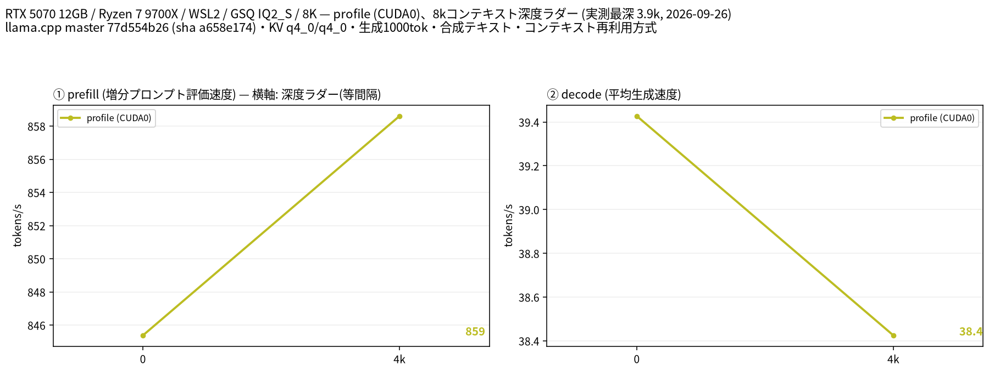

# RTX 5070 12GB 1枚で Qwen3.8 27B GSQ IQ2_S を計測（8K短縮プロファイル）

- **作成者**: fumimatsu
- **作成日**: 2026-09-26

## 概要

RTX 5070 12GB × 1とWSL2で、Qwen3.8 27B GSQ-RCO IQ2_Sを測定しました。
コンテキスト枠を8,192に設定し、実入力11 / 3,917トークンから各1,000トークンを生成した速度は、39.43 / 38.42 t/sでした。
12GBの単一GPUで27Bモデルを動かす一例です。ただし、低ビット量子化・合成文・各条件1回の短縮測定であり、回答品質や長文での速度は評価していません。

## ハードウェア

| 項目 | 内容 |
|------|------|
| コンピュータ / マザーボード | GIGABYTE X870M AORUS ELITE WIFI7 ICE |
| GPU | NVIDIA GeForce RTX 5070 × 1（VRAM 12 GB、nvidia-smi表示は12,227 MiB） |
| GPU 接続 | PCIe 5.0 x16（Windows側nvidia-smiで取得）。単一GPU |
| CPU | AMD Ryzen 7 9700X（8コア / 16スレッド） |
| メモリ | 64 GB（32 GB × 2） |
| GPU電力上限 | 250 W。測定のための電力上限・クロック変更なし |

GPUはWindowsの画面表示にも使用しています。モデル起動前のGPUメモリ使用量は1,735 MiBでした。
計測ツールのGPU計算プロセス検査では、計測サーバー以外のプロセスは検出されませんでした。

## ソフトウェア環境

| 項目 | 内容 |
|------|------|
| OS | Windows 11 Pro（10.0.26200）上のWSL2 Ubuntu 24.04.5 LTS / Linux 6.6.87.2-microsoft-standard-WSL2 |
| GPU ドライバ | 610.47（Windowsホスト） |
| llama.cpp | build 10981、commit `77d554b26`、Linux x86_64、CUDA 13.3バックエンド。`--version`表示は0.4.1-dev |
| 作図 | Python 3.12 / matplotlib 3.11.2、Noto Sans CJK JP |

## ベンチマーク

### 条件

| 項目 | 内容 |
|------|------|
| ツール | llama-split-bench `7af72d4085aa5073677d41389144112dd94fcb74`。計測・作図コードは未変更 |
| モデル | Qwen3.8-27B-GSQ-RCO-IQ2_S（ISTA-DASLab/Qwen3.8-27B-GSQ-RCO-GGUF、9,259,510,912 bytes） |
| 測定モード | `profile`（CUDA0のみ、単一構成） |
| ctx / stages | 8192 / 0,4000 |
| 生成長 | 各段1,000トークン、temperature 0、ignore_eos有効 |
| 新規入力prefill | 目標512 / 2048トークン、cache_prompt=false。各64トークン生成 |
| KV キャッシュ | q4_0 / q4_0 |
| 投機的デコード | なし（SPEC_ARGSは空） |
| Flash Attention / GPU層数 | on / `-ngl 999`（全層GPUオフロードを指定）、`-fit off` |
| batch / ubatch / threads | 2048 / 256 / 8 |
| スロット / 推論強度 | 1 / medium。チャットではなく、ツール既定の生のcompletionを使用 |
| その他 | Visionなし、実プロンプト補正なし（`--no-real`）、CACHE_ARGSは空 |
| 実施回数 | smoke test成功後、本測定1回。反復平均ではない |

モデルSHA-256は測定後に確認しました:
`16c9802111aa9ef3acde465188d6d601f8db128ee3d828ad983a5caca4135ecb`。
モデル配布元: [ISTA-DASLab/Qwen3.8-27B-GSQ-RCO-GGUF](https://huggingface.co/ISTA-DASLab/Qwen3.8-27B-GSQ-RCO-GGUF)。

上流の固定入力を使っています。最初の段は短い英文、次の段は連番付き英文を繰り返した合成文です。
個人の文書・リポジトリ・会話は入力していません。

### 結果



単位はt/s（tokens/s）。表のdepthはツールの目標値です。**8Kは確保枠であり、8K全文を入力した測定ではありません。**

| depth | prefill profile | decode profile |
|------:|------:|------:|
| 0 | 845.38 | 39.43 |
| 4000 | 858.61 | 38.42 |

depth 0のprefillには、新規入力試験の`pp2048`（実入力1,978トークン）の値を使っています。
decodeは実入力11トークンからの生成速度です。同じリクエストの測定値ではありません。
ラダー初段の短い入力から算出されたprefill値は、比較に適さないため表に載せていません。

| 目標depth | 実入力長（effective_depth） | cache_n | 生成トークン数 |
|------:|------:|------:|------:|
| 0 | 11 | 0 | 1000 |
| 4000 | 3917 | 0 | 1000 |

両段とも`cache_n=0`でした。ツールはキャッシュ再利用を有効にしていますが、今回の入力間では再利用されていません。
入力長の縮小リトライはなく、両段とも指定どおり1,000トークンを生成しました。

新規入力の処理速度（prefill）は次のとおりです。

| 目標入力長 | 実入力長（prompt_n） | cache_n | prefill（t/s） |
|------:|------:|------:|------:|
| 512 | 512 | 0 | 899.75 |
| 2048 | 1978 | 0 | 845.38 |

計測開始から完了まで約1分48秒でした（モデル起動・作図・終了処理を含む）。
段階測定の前後で記録したGPUメモリ使用量は10,831〜11,017 MiBです。
これはWindowsの表示用使用量も含むGPU全体の値で、モデル単独の使用量や連続監視によるピーク値ではありません。

### 再現手順

上記コミットの`llama-split-bench`で、`bench.local.conf`に表の設定を記載します。
`BIN`、`MODEL`、CUDA共有ライブラリーのパスは各環境に合わせ、`MACHINE`には中立な表示名を指定してください。
起動引数の一覧は添付の`argv-profile.txt`にあります。

```bash
# 単一GPUでの動作確認。本測定の集計には含めない。
bash run-bench.sh smoke-8k --profile --ctx 8192 --stages 0,4000 \
    --n-predict 100 --pp0-sizes 512,2048 --no-real

# 本測定。タグは毎回新しくする。
mkdir -p runs
setsid nohup bash run-bench.sh profile-8k --profile --ctx 8192 --stages 0,4000 \
    --n-predict 1000 --pp0-sizes 512,2048 --no-real > runs/profile-8k.log 2>&1 &
```

本測定では上記コマンドに10分のタイムアウトを付け、`BENCH-DONE`を確認しました。
WSLの終了直後にポート確認がTIME_WAITを使用中と判定したため、起動前検査だけを修正しています。
既存の待受サーバーを停止・無視する変更はしておらず、計測コードやモデル設定も変更していません。

### 所感と限界

今回の合成文では、約4K入力でも生成速度は約38 t/sでした。
12GBのGPUで27BのIQ2_Sモデルを試す際の、短い入力に対する速度の目安になります。

本測定は各条件1回です。温度やクロック、Windowsの画面表示の影響を切り分けておらず、
2点の差から長文での性能低下を一般化できません。量子化方式・実入力長・MTP・ランタイムが異なる他の結果とも、GPU性能だけの比較はできません。
コードの正確さや実エージェントの完了時間を判断するには、別途、実際の課題で検証する必要があります。

## 添付

- [run-info.json](attachment/2026-09-26_094401_profiling_qwen3.8_27b_gsq_iq2_s_on_rtx5070_12gb/run-info.json)
- [results-profile.json](attachment/2026-09-26_094401_profiling_qwen3.8_27b_gsq_iq2_s_on_rtx5070_12gb/results-profile.json)
- [results-profile-pp0.json](attachment/2026-09-26_094401_profiling_qwen3.8_27b_gsq_iq2_s_on_rtx5070_12gb/results-profile-pp0.json)
- [argv-profile.txt](attachment/2026-09-26_094401_profiling_qwen3.8_27b_gsq_iq2_s_on_rtx5070_12gb/argv-profile.txt)
- [split-bench-en.png](attachment/2026-09-26_094401_profiling_qwen3.8_27b_gsq_iq2_s_on_rtx5070_12gb/split-bench-en.png)

公開用の`run-info.json`と`argv-profile.txt`では、実行バイナリのパスを`/opt/llama-b10981/llama-server`、
モデルの配置先を`/models/`に置き換えています。測定値・バイナリのSHA-256・モデル名は変更していません。
サーバーログ、生成本文、GPUサンプラログ、モデル本体は添付していません。
