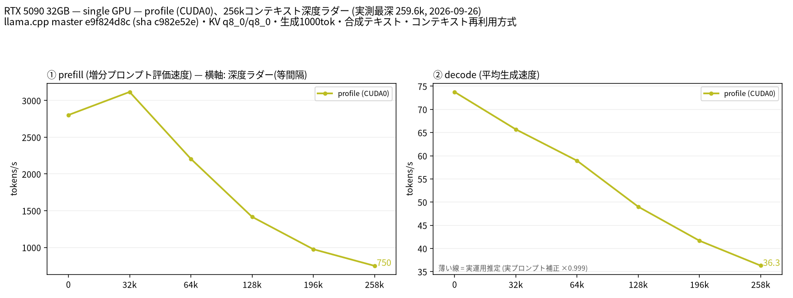

# RTX 5090 で Qwen3.8 27B を 262k コンテキストで測定

- **作成者**: completenovice-eng
- **作成日**: 2026-09-26

## 概要

RTX 5090 1 枚で Huihui-Qwen3.8-27B-abliterated-Q4_K.gguf を `--profile` 計測しました。コンテキスト長 262144、KV キャッシュ q8_0/q8_0、投機的デコードなしの条件で、258k 段まで完了しました。
258k 段では prefill 749.9 tok/s、decode 36.3 tok/s でした。実行中に2秒間隔で記録した VRAM 使用量は、258k 段の直前に 26,885 MiB、同段処理中の最大が 26,892 MiB でした。

## ハードウェア

| 項目 | 内容 |
|------|------|
| コンピュータ / マザーボード | Micro-Star International Co., Ltd. PRO B650-S (MS-7E26) |
| GPU | NVIDIA GeForce RTX 5090 × 1（VRAM 32 GB） |
| GPU 接続 | PCIe 4.0 ×16（計測時） |
| CPU | AMD Ryzen 9 9950X3D2 16-Core Processor |
| メモリ | 31 GiB（種類不明） |
| 電源 | 不明 |

## ソフトウェア環境

| 項目 | 内容 |
|------|------|
| OS | Ubuntu 24.04.5 LTS / WSL2、Linux 6.18 系 |
| GPU ドライバ | 616.92 |
| llama.cpp | b11182、commit `e9f824d8c`、CUDA |

## ベンチマーク

### 条件

| 項目 | 内容 |
|------|------|
| ツール | llama-split-bench commit `7af72d4085aa5073677d41389144112dd94fcb74` |
| モデル | Huihui-Qwen3.8-27B-abliterated-Q4_K.gguf（Q4_K、16.81 GB） |
| 測定モード | `--profile`、単一 GPU CUDA0 |
| ctx / stages | 262144 / 0, 32000, 64000, 128000, 196000, 258000（各段 decode 1000 tokens） |
| KV キャッシュ | q8_0 / q8_0 |
| 投機的デコード | なし |

### 結果

| 目標深度 | 実測深度 | Prefill (tok/s) | Decode (tok/s) |
|---------:|---------:|----------------:|---------------:|
| 0（新規 prompt 8k） | 11 | 3228.6 | 73.76 |
| 32k | 32093 | 3116.3 | 65.69 |
| 64k | 64806 | 2206.0 | 58.93 |
| 128k | 128788 | 1416.8 | 49.01 |
| 196k | 196429 | 975.8 | 41.67 |
| 258k | 259601 | 749.9 | 36.30 |

深度0の prefill は `results-profile-pp0.json` の 8192-token 新規 prompt 計測値です。ラダー先頭の11-token promptによる prefill 値は計測上の artifact のため使用していません。各段の実測深度はキャッシュを含む値です。

### VRAM 使用量

`nvidia-smi` でベンチ実行中に約2秒間隔で記録しました。258k 段に入る直前のサンプルは 26,885 MiB（20:29:06）、同段の処理中の最大値は 26,892 MiB（20:29:08）でした。ベンチ側の段開始時スナップショットも 26,892 MiB で、全体の最大値と同じです（GPU 合計 32,607 MiB）。サンプル周期と段開始時スナップショットは取得時刻が揃わないため、それぞれの値と時刻を記載しています。

### 所感

深度が増えるにつれて prefill と decode の速度は低下しました。258k 段までエラーなく完了し、VRAM 使用量は計測全体で約 26.3 GiB を超えませんでした。

## 添付

- [run-info.json](attachment/2026-09-26_203225_measuring_qwen3_8_27b_at_262k_context_on_rtx_5090/run-info.json)
- [results-profile.json](attachment/2026-09-26_203225_measuring_qwen3_8_27b_at_262k_context_on_rtx_5090/results-profile.json)
- [results-profile-pp0.json](attachment/2026-09-26_203225_measuring_qwen3_8_27b_at_262k_context_on_rtx_5090/results-profile-pp0.json)
- [results-real.json](attachment/2026-09-26_203225_measuring_qwen3_8_27b_at_262k_context_on_rtx_5090/results-real.json)
- [argv-profile.txt](attachment/2026-09-26_203225_measuring_qwen3_8_27b_at_262k_context_on_rtx_5090/argv-profile.txt)
- [vram-samples.csv](attachment/2026-09-26_203225_measuring_qwen3_8_27b_at_262k_context_on_rtx_5090/vram-samples.csv)
- [split-bench-en.png](attachment/2026-09-26_203225_measuring_qwen3_8_27b_at_262k_context_on_rtx_5090/split-bench-en.png)
