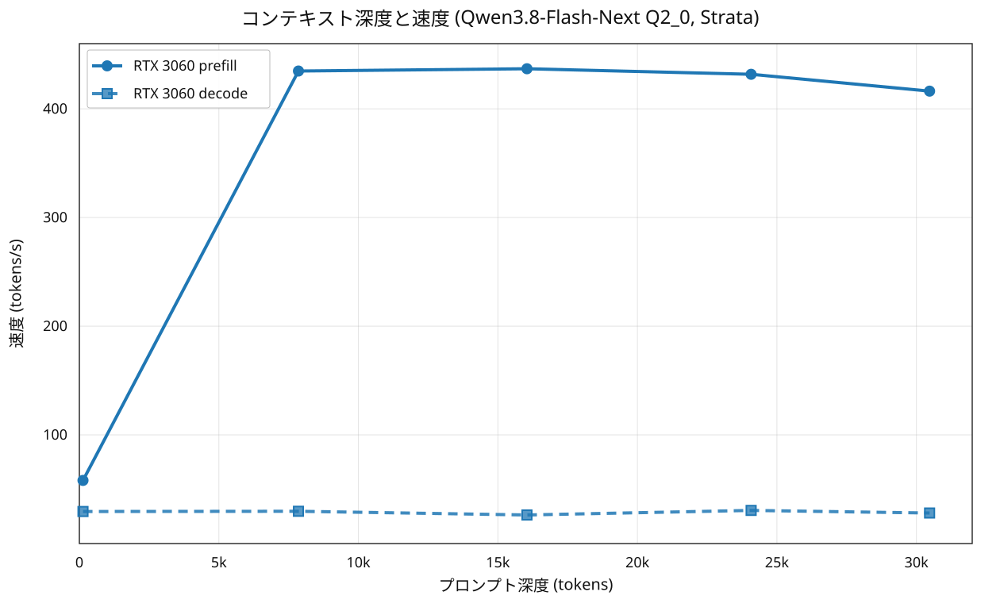

# RTX 3060 12GB + RAM で Strata により Qwen3.8-Flash-Next（125B MoE）を回す

- **作成者**: eightman999
- **作成日**: 2026-09-28

## 概要

有志エンジン [Strata](https://github.com/Niko1221/Strata) で **Qwen3.8-Flash-Next（125B MoE・6B 活性化・51B n-gram 埋め込み・4B MTP）** を、RTX 3060 12GB + 45 GiB RAM + NVMe SSD の一般 PC で常駐運用できるところまで持っていき、コンテキスト深度を変えて prefill / decode を実測した。

結果は decode **27〜33 tok/s**、増分 prefill **375〜395 tok/s**（いずれも ctx 32K・Q2_0）。同じ箱の llama.cpp で Qwen3.8 27B（dense）を回した[前回レポート](2026-09-21_170911_comparing_split_modes_of_qwen3.8_27b_on_rtx3060_and_tesla_v100.md)の decode が 13.7〜32.4 t/s（depth 128k〜0）だったのに対し、4.6 倍の総パラメータを持つ MoE が同等かそれ以上の decode を出す。

## ハードウェア

| 項目 | 内容 |
|------|------|
| コンピュータ / マザーボード | Thirdwave XA7C-R47T / ASRock B760 TW/D4（DDR4） |
| GPU | NVIDIA GeForce RTX 3060 12GB（SM86、計測対象）。Tesla V100-PCIE-32GB（SM70）も搭載するが本ランでは不使用 |
| GPU 接続 | PCIe、NVLink なし。3060 は PCIe 4.0 x16、V100 は PCIe 3.0 x4 でリンク |
| CPU | 13th Gen Intel Core i7-13700F（16 コア / 24 スレッド、AVX2・AVX-512 なし） |
| メモリ | 45 GiB（MemTotal 47,715,964 kB） |

## ソフトウェア環境

| 項目 | 内容 |
|------|------|
| OS | Ubuntu 26.04.1 LTS / Linux 7.0.0-34-generic |
| GPU ドライバ | NVIDIA 580.178.04（CUDA 13.0 相当） |
| Strata | v0.1 系、ソースから本機向けにコンパイル（`CMAKE_CUDA_ARCHITECTURES=86`、nvcc は CUDA 12.4）。prebuilt バイナリは linux 向け未配布のため自動でローカルビルドにフォールバック |
| OpenAI API | `http://127.0.0.1:8080/v1`（Anthropic `/v1/messages` も対応） |

### CUDA デバイス列挙の罠

本機では `nvidia-smi` の index 順（0=3060、1=V100）と CUDA ランタイムの列挙順が逆転しており、**CUDA device 0 が V100**。Strata のカーネルは sm_80 以上が必須（CMakeLists で `arch < 80` は FATAL_ERROR）なので、エンジンが CUDA0 = V100 を掴むと起動できない。起動スクリプトで

```sh
export CUDA_VISIBLE_DEVICES="GPU-<3060のUUID>"
```

として 3060 に固定した（UUID 指定なので PCI 再列挙にも強い）。V100 側は別の llama.cpp 常駐モデルが動いたまま共存できる。

## ベンチマーク

### 条件

| 項目 | 内容 |
|------|------|
| ツール | Strata の `serve` + 自作の深度ラダースクリプト（[strata_ladder.py](attachment/2026-09-28_142648_strata_flash_next_q20_on_rtx3060_plus_ram/strata_ladder.py)。llama-split-bench は `llama-server` 専用のため非適用、OpenAI API 越しに同一の「深さ別 prefill/decode」を計測） |
| モデル | Qwen3.8-Flash-Next **Q2_0**（ISTA-DASLab GSQ-RCO 量子化、GGUF 計 66.4 GB） |
| 分散配置 | GPU(3060): 共有層 + プロファイル頻度上位のエキスパートキャッシュ 4,720 個（6.08 GiB VRAM）。RAM: 全 24,576 エキスパートを CPU が計算。SSD: 29 GB の n-gram（PLE）ルックアップテーブル |
| 投機的デコード | MTP ドラフト層（`--spec 4 --spec-min-p 0.5`）、採用率は各段に記載 |
| ctx | 32,768（12 GB VRAM 向け推奨値）。KV キャッシュ int8 |
| その他 | llama-master 用の V100 常駐モデル（18 GB VRAM）は稼働したまま。測定中の他タスクなし |

### 結果

llama-split-bench 式の深度ラダー：各段は指定トークン長の新規プロンプトを投げて prefill（read）/ decode を計測する（Strata は OpenAI API 経由のため llama-split-bench は非適用、自作スクリプトで同等の計測を実施）。



| depth（プロンプト tok） | prefill t/s | decode t/s |
|------:|------:|------:|
| 130 | 58.1 | 29.5 |
| 7,852 | 434.8 | 29.7 |
| 16,042 | 436.9 | 26.3 |
| 24,076 | 431.8 | 30.5 |
| 30,472 | 416.3 | 28.1 |

depth 0 相当の prefill（生成なし・プロンプト長別）:

| prompt tok | prefill t/s |
|------:|------:|
| 598 | 226.1 |
| 2,080 | 369.0 |
| 8,242 | 420.1 |

計測時の最大 VRAM 使用量は 11,521 MiB。decode は深度に対しほぼ平坦（29.5 → 28.1 t/s）。

参考：初回計測は同一会話を伸ばす累積型で実施した（エンジンは差分のみ再読するため、下表の prefill はその段で新規に読んだ分の速度）。MTP 採用率も併記する。

| depth | 新規読み込み tok | prefill t/s | decode t/s | MTP 採用 |
|------:|------:|------:|------:|------:|
| 8,708 | 8,708 | 384.6 | 27.2 | 149/196（76%） |
| 14,719 | 6,016 | 394.5 | 33.1 | 148/169（88%） |
| 23,720 | 9,006 | 375.0 | 32.1 | 143/188（76%） |
| 29,732 | 6,017 | 377.7 | 30.2 | 131/169（78%） |

短い会話（<100 tok プロンプト）: decode 26.2〜28.7 t/s、prefill 38〜44 t/s（小さいプロンプトではオーバーヘッドが効く）。

### 所感

- **125B がゲーミング PC で実用的**: 3060 12GB + 45 GiB RAM で 30 t/s 前後。「読むより速い」域に達している。96 GiB クラスの VRAM なしでこのサイズを常用できるのは Strata の CPU エキスパート計算 + MTP の効果が大きい。
- **深度への鈍さ**: 48 層中 36 層が Gated DeltaNet（線形・KV を持たない）、QSA（sparse attention）は 12 層のみ、という設計のおかげで decode が深度でほとんど落ちない（27 → 33 → 32 → 30 t/s）。dense モデルの llama.cpp では 128k で 13 t/s まで落ちたのと対照的。
- **RAM が壁**: 公式推奨 48 GB に対し本機は 45.5 GiB。Q2_0 のエキスパートアリーナ ~34 GB + ランタイムで 35 GiB 使用・残り ~10 GiB で動いたが余裕は薄い。IQ2_XS（+1.5 GB）なら恐らく動くが、IQ3_XXS 以上は RAM 増設が必要。
- **3060 の位置づけ**: 作者の 5070（672 GB/s・12 GB）での Q2_0 は 88〜95 t/s。3060 は帯域がほぼ半分でキャッシュ容量は同じ 12 GB なので ~30 t/s は妥当な線。CPU 側（13700F・24 スレッド）は計測された 7600（6 コア）より強いので、CPU エキスパート側ではむしろ有利。
- **V100 は使えない**: sm_70 は Strata のカーネル要件（sm_80+、tf32/bf16 mma）を満たさず CMake が拒否する。VRAM 追加でエキスパートキャッシュを増やす方向は現状不可。32 GB VRAM の使い道は別エンジン（llama.cpp 系）に限定される。

## 添付

- [strata-ladder-ja.svg](attachment/2026-09-28_142648_strata_flash_next_q20_on_rtx3060_plus_ram/strata-ladder-ja.svg) / [strata-ladder-en.svg](attachment/2026-09-28_142648_strata_flash_next_q20_on_rtx3060_plus_ram/strata-ladder-en.svg)（深度ラダーの図）
- [results-strata-ladder.json](attachment/2026-09-28_142648_strata_flash_next_q20_on_rtx3060_plus_ram/results-strata-ladder.json)（新規プロンプト型ラダー + depth0 prefill の生データ）
- [argv-3060-ladder.txt](attachment/2026-09-28_142648_strata_flash_next_q20_on_rtx3060_plus_ram/argv-3060-ladder.txt)（エンジン起動引数）
- [results-strata-ladder-cumulative.json](attachment/2026-09-28_142648_strata_flash_next_q20_on_rtx3060_plus_ram/results-strata-ladder-cumulative.json)（初回計測：会話累積型ラダーの usage・速度・採用率）
- [strata-engine-log.txt](attachment/2026-09-28_142648_strata_flash_next_q20_on_rtx3060_plus_ram/strata-engine-log.txt)（エンジンの起動ログと各リクエスト統計）
- [strata_ladder.py](attachment/2026-09-28_142648_strata_flash_next_q20_on_rtx3060_plus_ram/strata_ladder.py)（計測スクリプト）
