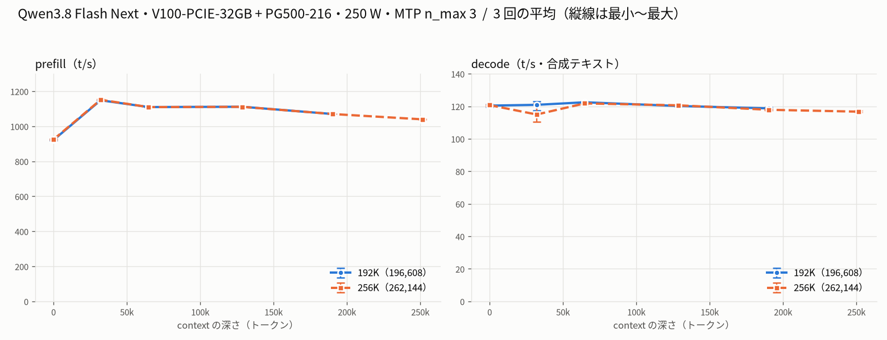

# Tesla V100-PCIE-32GB と PG500-216 で Qwen3.8 Flash Next を 192k / 256k で計測

- **作成者**: warabii
- **作成日**: 2026-10-03

## 概要

NVLink なしの V100-PCIE-32GB と PG500-216（各 32 GB）の 2 枚（GPU 間の P2P は使わない）で Qwen3.8 Flash Next（GGUF 80 GiB）を動かし、192k と 256k のコンテキストで prefill / decode を測りました。電力制限は 250 W です。
全層を GPU に置いた layer 分割で pipeline 並列を使い、prefill は depth 32k〜190k で 1,070〜1,151 t/s、256k の構成では depth 250k でも 1,040 t/s でした。192k と 256k の速さはほぼ同じです。
decode（合成テキスト・MTP あり）は 115〜122 t/s、実プロンプト（temp 0.7）では 76〜93 t/s でした。値はどれも各 context 3 回の平均です。
使っている llama.cpp には自作の変更（未公開）を加えています。

## ハードウェア

| 項目 | 内容 |
|------|------|
| コンピュータ / マザーボード | 自作 PC（MSI MPG X570 GAMING EDGE WIFI（MS-7C37）） |
| GPU | Tesla V100-PCIE-32GB ＋ Tesla PG500-216（各 1 枚・VRAM 32 GB / 枚。画面出力用の GeForce GTX 750 Ti は計測に使っていません） |
| GPU 接続 | PG500-216 は PCIe Gen3 x16、V100 は PCIe Gen3 x4（チップセット側のスロットで電気的に x4。GPU 自体は x16 対応）。NVLink なし（`nvidia-smi topo -m` で PHB）。GPU 間の P2P は使っていません（`GGML_CUDA_P2P` を設定していない。`nvidia-smi topo -p2p r` では 2 枚の間は OK と出ます） |
| CPU | AMD Ryzen 7 5700X3D（8 コア / 16 スレッド） |
| メモリ | 30 GiB（`free -h`）。DDR4 3000MHz |
| 電源 | 650 W |

## ソフトウェア環境

| 項目 | 内容 |
|------|------|
| OS | Ubuntu 26.04.1 LTS / Linux 7.0.0-34-generic |
| GPU ドライバ | 580.178.04（CUDA 13.0）。ビルドは CUDA Toolkit 12.9.86 |
| llama.cpp | 0.5.0（7fe450e）に pentacoxian 氏の `qwen4exp` 対応パッチ（v3）と同氏の v4 の修正 1 件（グラフ構築での `cparams` のぶら下がり参照の修正・常時有効。v4 自体は公開が取り下げられています）、upstream PR #29599（PLE の行の先読み）、upstream PR #27694（投機的デコードの確率的な下書き・未マージ）の移植と、自作の変更（環境変数で有効になるもの・未公開）を加え、`-DGGML_SCHED_MAX_COPIES=2` でビルドしたもの。CUDA バックエンド（`CMAKE_CUDA_ARCHITECTURES=70`）。バイナリの sha256 は run-info.json に記録 |

## ベンチマーク

### 条件

| 項目 | 内容 |
|------|------|
| ツール | llama-split-bench 7af72d4（変更なし） |
| モデル | Qwen3.8-Flash-Next-IQ3E-Q8D-MTP.gguf（80.0 GiB、アーキテクチャ `qwen4exp`）＋ mmproj-F16（862 MiB、`MTMD_ON_DEMAND=1` で画像のときだけ GPU に載せる設定。ベンチでは画像を使っていません） |
| 測定モード | profile（CUDA0+CUDA1・layer 分割）を context ごとに 3 回、計 6 回（192k と 256k を交互に）。結果は 3 回の平均。tensor 分割は `qwen4exp` で未実装 |
| ctx / stages | 192k: 196608 / 0,32000,64000,128000,190000。256k: 262144 / 0,32000,64000,128000,190000,250000 |
| KV キャッシュ | q8_0 / q8_0 |
| 投機的デコード | `--spec-type draft-mtp --spec-draft-n-max 3 --spec-draft-sampling probabilistic` |
| 電力制限 | 250 W（既定・上限）。両 GPU とも同じ値 |
| その他 | `-ngl 99 --fit off --tensor-split 26,24`、`--batch-size 8192 --ubatch-size 512`、`-fa on`、`-t 8 --threads-batch 16`、`--load-mode mmap`、`--reasoning off`、生成 1000 トークン / 段。環境変数は argv-*.txt を参照 |

### 改造前からの変更点

改造前は、チューニングを始める前にこの PC で使っていた設定です（llama.cpp に自作の変更なし）。192k と 256k で違うのは ctx だけです。下の表にない引数・環境変数（ubatch 512・KV q8_0・MTP の設定・スレッド数など）は改造前と同じです。

| 項目 | 改造前 | 本構成 |
|------|------|------|
| llama.cpp | 0.5.0 ＋ `qwen4exp` 対応パッチ（v3）＋ PR #29599 | 左に PR #27694 の移植、pentacoxian 氏の v4 の修正 1 件、自作の変更（未公開）を追加 |
| ビルド | `GGML_SCHED_MAX_COPIES=4`（既定） | `GGML_SCHED_MAX_COPIES=2` |
| 層の置き場所 | `-ngl auto --fit on --fit-target 512`（llama.cpp が VRAM に合わせてテンソルの置き場所を決める。一部のテンソルの置き場所を指定するため、pipeline 並列は有効にならない） | `-ngl 99 --fit off --tensor-split 26,24`（全層 GPU・pipeline 並列が有効） |
| `--batch-size` | 2048 | 8192 |
| 下書きのサンプリング | （オプションなし） | `--spec-draft-sampling probabilistic` |
| 追加した環境変数 | — | `LLAMA_PP_REUSE_MAX_TOKENS=16`・`LLAMA_PP_PLAN_AHEAD=1`・`LLAMA_MTP_DRAFT_VOCAB`・`LLAMA_KV_PAD_GEO=2`・`LLAMA_QSA_BLK_REBUILD=1`・`CUDA_SCALE_LAUNCH_QUEUES=4x` |

各変更の中身:

- **全層を GPU に置く**（`-ngl 99 --fit off --tensor-split 26,24`）: 層をすべて 2 枚に割り当て、テンソルの置き場所の指定をしないので、llama.cpp の pipeline 並列が自動で有効になります。80 GiB のうち `per_layer_token_embd`（約 27 GiB の埋め込み表）は層ではなく、ホスト RAM（mmap）に置かれます
- **`--batch-size 8192`**: pipeline 並列は 1 回の `llama_decode`（`--batch-size` 分）の中の ubatch どうしを重ねるので、1 回に渡すトークンを増やして重なる ubatch を増やします
- **`GGML_SCHED_MAX_COPIES=2` でビルド**（既定 4）: pipeline 並列の入力の複製を減らし、VRAM を空けます（ソースが同じで複製の数だけを変えたビルドどうしの比較で、prefill の速さは同じまま、VRAM の最大が 1 枚あたり約 0.6〜0.7 GiB 減りました）。これで 256k でも全層 GPU・ubatch 512 で載ります
- **自作の変更**（環境変数で有効・未公開）:
  - pipeline 並列で 16 トークン以上の ubatch の計算グラフの再利用をやめる（`LLAMA_PP_REUSE_MAX_TOKENS=16`）。この版の llama.cpp は、再利用するたびに全 GPU を同期して prefill の重なりが消えるため
  - prefill の先読み計画（`LLAMA_PP_PLAN_AHEAD=1`）: ubatch ごとに KV の参照範囲が伸びて計算バッファを取り直すと、全 GPU が同期して pipeline 並列の重なりが切れます。1 回の `llama_decode` の最初に、その呼び出しの最後の ubatch の大きさで予約しておき、途中の取り直しをなくします（計算の中身は変えない）。QSA は KV の参照範囲に応じてトークンを chunk に分けるため、予約用のグラフが実際のグラフと同じ形になる範囲（1 chunk・参照範囲 32,768 まで）でだけ使います（既定の上限。始める時点の参照範囲が 32,768 未満で、予約する範囲が 32,768 以下に収まるとき）。このベンチで使われるのは depth 0 と 32k の段（32k の段の終わりで参照範囲がちょうど 32,768）で、それより深い段では使われません
  - KV の参照範囲の丸め方（`LLAMA_KV_PAD_GEO=2`）: prompt の ubatch（64 トークン以上）では、参照範囲を「使用中のセル数以下で最大の 2 のべき乗」の 1/4 刻みで切り上げます。計算バッファの取り直し（と全 GPU の同期）が ubatch ごとから、プロンプトの長さが倍になるあいだに数回まで減ります（代わりに、マスクされるセルが最大 1/4 増える）。上限の 32,768 を超える深さでは、取り直しの回数はこちらで減らしています。decode では元の刻みのままです
  - MTP の下書きの出力ヘッドを頻出 65,536 語に絞る（`LLAMA_MTP_DRAFT_VOCAB`）。検証（本体の出力）は全 248k 語のままなので、出力は変わりません
  - ほかに、prompt cache から会話を戻したあとの QSA の索引の作り直し（`LLAMA_QSA_BLK_REBUILD=1`）。会話の切り替えでだけ効き、このベンチの値には関係しません
- **確率的な下書き**（PR #27694 の移植・`--spec-draft-sampling probabilistic`）: temperature > 0 のとき、下書きもサンプリングして棄却サンプリングで検証します（出力の分布は変わらない方式）。greedy（temp 0）では効きません。このベンチでは実プロンプト（temp 0.7）の測定だけに関係します
- **`CUDA_SCALE_LAUNCH_QUEUES=4x`**: CUDA 側の環境変数で、llama.cpp の `docs/build.md` が複数 GPU の pipeline 並列の prefill に効くとして案内している設定です

### 結果

各 context 3 回の平均をまとめた図です。縦線は 3 回の最小〜最大です（ツールが回ごとに出力した図は添付の各フォルダにあります）。
depth 0 の prefill は新規プロンプト（1,978 トークン）の値です。ラダー初段（11 トークン）の prefill は表に載せていません。

depth ごとの prefill / decode（t/s、3 回の平均）:

| depth | 192k prefill | 192k decode | 256k prefill | 256k decode |
|------:|------:|------:|------:|------:|
| 0 | 921.5 | 120.4 | 924.5 | 120.7 |
| 32k | 1148.5 | 120.9 | 1151.4 | 114.9 |
| 64k | 1109.7 | 122.5 | 1109.6 | 121.8 |
| 128k | 1111.5 | 120.2 | 1111.0 | 120.6 |
| 190k | 1069.9 | 118.7 | 1069.9 | 117.8 |
| 250k | — | — | 1039.7 | 116.7 |

decode の 3 回の最小〜最大（t/s）。prefill は 3 回の差が各段 0.7% 以内なので省いています:

| depth | 192k decode | 256k decode |
|------:|------:|------:|
| 0 | 119.6〜121.2 | 120.3〜121.0 |
| 32k | 117.3〜123.0 | 110.5〜121.7 |
| 64k | 122.1〜122.9 | 121.3〜122.1 |
| 128k | 120.0〜120.5 | 120.4〜120.7 |
| 190k | 117.7〜119.4 | 117.6〜118.3 |
| 250k | — | 116.4〜117.2 |

depth 0 の新規プロンプト prefill（t/s、3 回の平均）:

| プロンプト長 | 192k | 256k |
|------:|------:|------:|
| 512 | 679.6 | 687.8 |
| 1978 | 921.5 | 924.5 |
| 8077 | 1122.6 | 1125.3 |

実プロンプト（3 種、temp 0.7 / top_p 0.9、1200 トークン生成）の decode（t/s、3 回の平均。括弧内は最小〜最大と MTP の受理率の平均）:

| プロンプト | 192k | 256k |
|------|------:|------:|
| design | 85.6（84.5〜86.8・受理 57%） | 92.8（90.3〜96.0・受理 65%） |
| review | 76.0（73.1〜79.2・受理 47%） | 75.6（74.4〜77.1・受理 47%） |
| qa | 79.1（78.9〜79.3・受理 50%） | 78.2（76.0〜79.7・受理 49%） |

VRAM 使用量の最大（MiB、32,768 MiB 中・3 回の最大・results-profile.json の nvidia-smi の index 0 / 2。index 1 は GTX 750 Ti）:

| context | V100 | PG500 |
|------|------:|------:|
| 192k | 31,266 | 31,132 |
| 256k | 32,288 | 32,370 |

MTP のドラフト受理率は、ラダーの合成テキストでは depth 32k 以外で 94〜99%、depth 32k は回によって 86〜98% でした（理由は所感）。

### 所感

- **prefill は depth 32k〜190k で約 1,070〜1,150 t/s、256k の構成では depth 250k でも 1,040 t/s でした**。192k と 256k は同じ depth でほぼ同じ値で、context を広げても prefill は遅くなりませんでした。3 回の差は各段 0.7% 以内で、prefill はよく再現します
- 新規プロンプトの prefill は短いほど遅く（512 トークンで約 680〜690 t/s、8,077 トークンで約 1,120〜1,125 t/s）、深さ 32k でいちばん速くなります。pipeline 並列は 1 回の `llama_decode`（`--batch-size` 分）の中の ubatch どうしを重ねるので、短いプロンプトでは重なる ubatch が少ないためと見ています（推定）
- **decode は合成テキストで 115〜122 t/s、実プロンプトでは 76〜93 t/s でした（3 回の平均）**。1 トークンは V100 の層と PG500 の層を順に通るため、pipeline 並列は decode を速くしません。実プロンプトでは MTP の受理率が 47〜65% と低く、速さはプロンプトによって大きく変わり、同じプロンプトでも回によって最大 6.0 t/s 違いました（temp 0.7 で生成文が毎回変わるため）
- **depth 32k の decode だけ、回によって 110.5〜123.0 t/s と大きく揺れました**（ほかの depth は 3 回の差が 1.5% 以内）。ラダーは greedy（temperature 0）ですが、同じバイナリ・同じ引数・同じプロンプトでも生成文は回ごとに変わります（計算のどこで差が出るかは調べていません）。ラダーは `/completion` に生のプロンプトを送り、チャットテンプレートを通らないので、`--reasoning off` でもモデルが自分で冒頭に思考（`<think>`）を書きます。depth 32k では、この思考で直前の行を何度も読み直して長く書く回がありました。6 回の思考の中身の長さと decode を比べると、300〜388 文字の 3 回は 121.7〜123.0 t/s（受理率 96〜98%）、1,086 文字の回は 117.3 t/s（93%）、3,244 / 3,618 文字の 2 回は 112.6 / 110.5 t/s（87% / 86%）で、思考が長い回ほど受理率と decode が低くなりました（思考の部分だけの受理率は測っていないので、思考の文が下書きに当てにくいためかは確かめていません）。256k の depth 32k の平均（114.9 t/s）が 192k（120.9 t/s）より低いのは、長い思考の回が 3 回中 2 回あったためと見ています（推定。回数が少なく、context の大きさで起こりやすさが変わるかまでは言えません）。256k の depth 64k〜250k は 116.7〜121.8 t/s で 192k とほぼ同じです
- **256k の VRAM は最大で PG500 が 32,370 MiB（残り約 400 MiB）で、余裕はほとんどありません**。192k は 1 枚あたり約 1.5 GiB の余裕があります
- 250 W では、6 回とも電力上限・温度による減速は一度も出ていません（ツールとは別に計測中に取った 1 秒ごとの nvidia-smi の記録の `clocks_event_reasons`）。最大の消費電力は 1 枚で 231 W、最高温度は GPU 64 ℃ / HBM 64 ℃でした
- 上の減速と温度は、ツールのサンプラ（sampler-*.log）ではなく上記の nvidia-smi の記録（両 Tesla・添付なし）から出しています。サンプラは 2 秒ごとで、減速の理由（`clocks_event_reasons`）を記録しないためです。なお、ツールの他プロセス検知は CUDA の番号を nvidia-smi の番号として扱うため、この PC では 2 枚目（PG500）の代わりに GTX 750 Ti を見ています。計測中は本番の llama-server を止め、ほかの GPU 処理は動かしていません

## 添付

- [bench-ja.png](attachment/2026-10-03_122722_profiling_qwen3.8_flash_next_at_192k_and_256k_on_tesla_v100_pcie_and_pg500_216/bench-ja.png) / [bench-en.png](attachment/2026-10-03_122722_profiling_qwen3.8_flash_next_at_192k_and_256k_on_tesla_v100_pcie_and_pg500_216/bench-en.png)（各 context 3 回の平均と最小〜最大）
- [summary-ja.png](attachment/2026-10-03_122722_profiling_qwen3.8_flash_next_at_192k_and_256k_on_tesla_v100_pcie_and_pg500_216/summary-ja.png)（環境・条件・結果表・図を 1 枚にまとめたもの）
- 回ごとの run-info.json: 192k の [1 回目](attachment/2026-10-03_122722_profiling_qwen3.8_flash_next_at_192k_and_256k_on_tesla_v100_pcie_and_pg500_216/192k-1/run-info.json) /
  [2 回目](attachment/2026-10-03_122722_profiling_qwen3.8_flash_next_at_192k_and_256k_on_tesla_v100_pcie_and_pg500_216/192k-2/run-info.json) /
  [3 回目](attachment/2026-10-03_122722_profiling_qwen3.8_flash_next_at_192k_and_256k_on_tesla_v100_pcie_and_pg500_216/192k-3/run-info.json)、
  256k の [1 回目](attachment/2026-10-03_122722_profiling_qwen3.8_flash_next_at_192k_and_256k_on_tesla_v100_pcie_and_pg500_216/256k-1/run-info.json) /
  [2 回目](attachment/2026-10-03_122722_profiling_qwen3.8_flash_next_at_192k_and_256k_on_tesla_v100_pcie_and_pg500_216/256k-2/run-info.json) /
  [3 回目](attachment/2026-10-03_122722_profiling_qwen3.8_flash_next_at_192k_and_256k_on_tesla_v100_pcie_and_pg500_216/256k-3/run-info.json)。
  同じフォルダ（`192k-1/` 〜 `256k-3/`）に results-profile.json・results-profile-pp0.json・results-real.json・argv-profile.txt・ツールが出力した図（split-bench-ja.png / split-bench-en.png）もあります
- GPU の UUID は `GPU-<uuid>` に置き換えています
