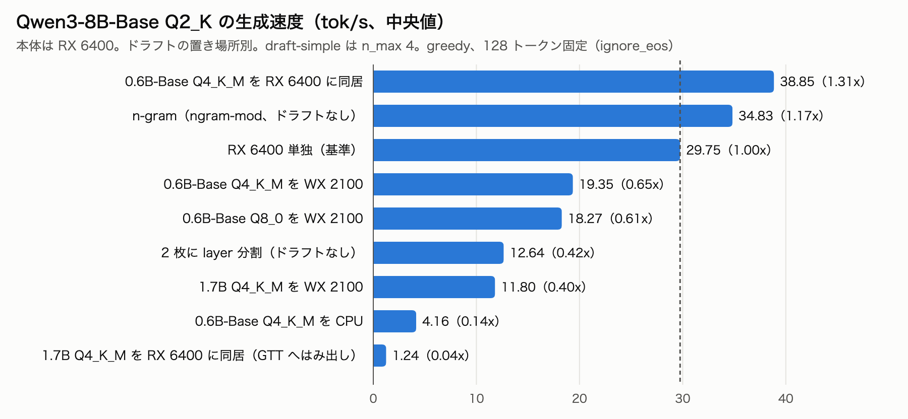

# RX 6400 + Radeon Pro WX 2100 で Qwen3-8B-Base の投機的デコードをドラフトの置き場所別に比較

- **作成者**: eightman999
- **作成日**: 2026-10-07

## 概要

マイニング用マザーボード（BIOSTAR TB250-BTC PRO）で、主 GPU を RX 6400 4 GB、第 2 GPU を Radeon Pro WX 2100 2 GB（PCIe x1）にした構成です。本体は Qwen3-8B-Base Q2_K を RX 6400 に置き、llama-server の投機的デコード（draft-simple）を、ドラフトモデルの大きさと置き場所を変えて比べました。

- **最速は、Qwen3-0.6B-Base Q4_K_M を本体と同じ RX 6400 に同居させた構成で、1.31x（29.75 → 38.85 tok/s）。**
- **第 2 GPU の WX 2100 は、ドラフト置き場にしても layer 分割の容量として使っても、RX 6400 単独より遅くなりました。**
  - ドラフト置き場（0.6B / 1.7B）: 0.24〜0.65x
  - layer 分割: 0.42x

## ハードウェア

| 項目 | 内容 |
|------|------|
| コンピュータ / マザーボード | BIOSTAR TB250-BTC PRO |
| GPU | AMD Radeon RX 6400 × 1（VRAM 4 GB）+ AMD Radeon Pro WX 2100 × 1（VRAM 2 GB） このほかに GeForce GT 430 / GT 710 / GT 730 も挿さっているが、今回は使っていない（後述） |
| GPU 接続 | RX 6400: x16 スロット（実際のリンク世代・幅は未確認） WX 2100: PCIe x1（sysfs の current_link は 5.0 GT/s x1） |
| CPU | Intel Celeron G3930（2 コア、AVX 無し） |
| メモリ | 32 GB |
| 電源 | 不明 |

## ソフトウェア環境

| 項目 | 内容 |
|------|------|
| OS | Debian 13 (trixie) / Linux 6.12.107 |
| GPU ドライバ | amdgpu（カーネル）+ Mesa RADV 25.0.7 NVIDIA 390 の Vulkan ICD が llama.cpp を落とすため、`VK_ICD_FILENAMES=/usr/share/vulkan/icd.d/radeon_icd.json` で Radeon だけを見せている |
| llama.cpp | b11384（commit 0faee50）、Vulkan バックエンド。`Vulkan0` = RX 6400、`Vulkan1` = WX 2100 |

## ベンチマーク

### 条件

| 項目 | 内容 |
|------|------|
| ツール | 自作ハーネス（[tb250-distill の `tb250distill/specbench`](https://github.com/eightman999/tb250-distill/tree/e5a28bb/tb250distill/specbench)、commit e5a28bb）。llama-server を構成ごとに起動し、`/completion` の `timings` を集計する。llama-split-bench は使っていない |
| 本体モデル | Qwen3-8B-Base。HF の safetensors を `convert_hf_to_gguf.py` で変換し、imatrix なしで量子化した Q2_K（3.28 GB）/ Q3_K_S（3.77 GB） |
| ドラフトモデル | Qwen3-1.7B Q4_K_M（1.28 GB） Qwen3-0.6B-Base Q8_0（0.64 GB）/ Q4_K_M（0.40 GB）（自前で量子化） Qwen3-0.6B Q8_0（0.64 GB、Qwen 公式 GGUF） |
| 共通の引数 | `-ngl all -c 1024 -np 1 -t 2 -fit off`（`-fit off` で ngl 等の自動調整を止め、条件を固定）。 ドラフトありの場合は `--spec-type draft-simple -md <draft> -devd <Vulkan0 / Vulkan1 / none> -ngld all --spec-draft-n-max N` |
| 生成条件 | greedy（temperature 0、seed 42）、`cache_prompt false`、`ignore_eos true`、`n_predict 128` |
| プロンプト | 8 本（code_c / code_py / json / list / ja_explain / ja_prose / en_explain / en_story）× 2 回。warmup 1 回は集計から除外 |
| KV キャッシュ | f16（Q3_K_S を RX 6400 単独に載せる構成だけ q8_0） |
| 指標 | gen tok/s は `timings.predicted_per_second` の中央値。J/token は amdgpu の sysfs から読んだ電力を、request の時間で積分した値（RX 6400 + WX 2100 の合計。CPU・マザーボード分は含まない） |

### 結果

**ドラフト 0.6B（run draft06）**

基準は RX 6400 単独の Q2_K（29.75 tok/s）。表で注記のない n_max は 4。

| 構成 | gen tok/s | 基準比 | 受理率 | J/token | VRAM peak MiB（RX / WX） |
|------|---:|---:|---:|---:|---|
| RX 6400 単独（基準） | 29.75 | 1.00x | - | 1.592 | 3181 / - |
| **0.6B-Base Q4_K_M を RX 6400 に同居** | **38.85** | **1.31x** | 0.72 | **1.177** | 3693 / - |
| n-gram（`--spec-type ngram-mod`、ドラフトモデルなし） | 34.83 | 1.17x | 0.70 | 1.222 | 3181 / - |
| 0.6B-Base Q4_K_M を WX 2100 | 19.35 | 0.65x | 0.72 | 1.884 | 3181 / 519 |
| 0.6B-Base Q8_0 を WX 2100（n_max 2） | 17.36 | 0.58x | 0.82 | 1.971 | 3181 / 751 |
| 0.6B-Base Q8_0 を WX 2100 | 18.27 | 0.61x | 0.70 | 1.990 | 3181 / 751 |
| 0.6B-Base Q8_0 を WX 2100（n_max 8） | 12.38 | 0.42x | 0.55 | 3.040 | 3181 / 751 |
| 0.6B 公式 Q8_0 を WX 2100 | 17.58 | 0.59x | 0.68 | 2.037 | 3181 / 751 |
| 0.6B-Base Q4_K_M を CPU | 4.16 | 0.14x | 0.70 | 2.113 | 3181 / - |
| Q3_K_S を RX 6400 単独（KV q8_0） | 22.57 | 0.76x | - | 2.083 | 3519 / - |
| Q3_K_S（KV q8_0）+ 0.6B-Base Q4_K_M を WX 2100 | 15.60 | 0.52x | 0.68 | 2.101 | 3519 / 519 |

**ドラフト 1.7B と layer 分割（run main1、同じ日の別 run）**

基準は同じく RX 6400 単独の Q2_K（29.73 tok/s）。

| 構成 | gen tok/s | 基準比 | 受理率 | J/token | VRAM peak MiB（RX / WX） |
|------|---:|---:|---:|---:|---|
| RX 6400 単独（基準） | 29.73 | 1.00x | - | 1.578 | 3181 / - |
| 1.7B Q4_K_M を WX 2100（n_max 2 / 4 / 8） | 12.52 / 11.80 / 7.28 | 0.42 / 0.40 / 0.24x | 0.79 / 0.69 / 0.53 | 2.772 / 2.940 / 4.641 | 3181 / 1216 |
| 1.7B Q4_K_M を WX 2100（n_max 8、`--spec-draft-p-min 0.75`） | 10.34 | 0.35x | 0.91 | 3.061 | 3181 / 1216 |
| 1.7B Q4_K_M を RX 6400 に同居 | 1.24 | 0.04x | 0.68 | 11.551 | 3366 / - |
| 1.7B Q4_K_M を CPU | 1.77 | 0.06x | 0.68 | 3.670 | 3185 / - |
| n-gram（ngram-simple / ngram-mod） | 32.70 / 34.88 | 1.10 / 1.17x | 0.62 / 0.70 | 1.371 / 1.228 | 3181 / - |
| Q2_K を 2 枚に layer 分割 | 12.64 | 0.42x | - | 2.936 | 1938 / 1410 |
| Q3_K_S を 2 枚に layer 分割 | 10.06 | 0.34x | - | 3.572 | 2220 / 1534 |

カテゴリ別の値は添付の `*-summary.txt` にある。0.6B を同居させた構成は多くのカテゴリで 35〜46 tok/s だったが、en_explain だけは受理率が低く 21.8 tok/s で、基準より遅かった。

### 所感

- **このマシンでは、第 2 GPU（WX 2100、PCIe x1）を使うと遅くなった。** ドラフト置き場にしても、layer 分割の容量にしても同じだった。
  - 0.6B ドラフトを WX 2100 に置いた場合と RX 6400 に同居させた場合とで、受理率はほぼ同じ（0.72）。差はドラフト側の 1 トークンあたりの時間と、GPU 間の受け渡しにあると考えている。ただし内訳は測っていない。
  - WX 2100 では Q4_K_M のほうが Q8_0 より速く、帯域律速らしい。
- **小さいドラフトを本体と同じ GPU に同居させるのが、最も速かった。** 0.6B Q4_K_M は 1.31x で、電力あたりの効率も最良だった。
- **1.7B の同居（1.24 tok/s）は、VRAM に収まっていなかった。** 同じ構成を起動し直して `mem_info_gtt_used` を読むと、GTT が 13 MiB から 1066 MiB に増え、ドラフトがシステムメモリへはみ出していた。`-fit off` でも起動は成功するので、VRAM の数字だけ見ると気づきにくい。
- **Base と post-trained のドラフトの差は小さかった**（受理率 0.70 と 0.68）。n_max は 2〜4 が良く、8 では受理率が落ちて遅くなった。
- **CPU ドラフトは、AVX 無しの Celeron（2 コア）では対照にしかならない。**

**注意**
- `ignore_eos` で 128 トークンに固定したため、base モデルの出力が途中から反復しやすい。n-gram の利得と受理率は、実際の用途より高く出ている可能性がある。EOS で止める条件では測っていない。
- greedy でも、ドラフトの有無や分割の有無で出力が分岐することがあった。本体単独の 2 回の一致率は 8/8、ドラフトありは 0.38〜0.75。
- Q3_K_S と 0.6B を RX 6400 に同居させる構成は測っていない。

**GeForce（GT 430 / GT 710 / GT 730）を使わなかった理由**
- この構成の NVIDIA は 390 ドライバで、その Vulkan ICD は llama.cpp を落とすため外している。
- 現行の llama.cpp には、Fermi（GT 430、sm_21）で動くバックエンドが無い。
- 2023 年 5 月版の llama.cpp（CLBlast）なら GT 430 でも動く。ただし、OpenLLaMA-3B Q4_0 の decode は GPU オフロードで 1.35〜2.40 t/s で、CPU だけ（4.91 t/s）より遅い。ドラフトに使っても速くならないので、対象外にした。

## 添付

- [main1-summary.txt](attachment/2026-10-07_143125_comparing_speculative_decoding_draft_placement_for_qwen3_8b_base_on_rx6400_and_wx2100/main1-summary.txt) / [draft06-summary.txt](attachment/2026-10-07_143125_comparing_speculative_decoding_draft_placement_for_qwen3_8b_base_on_rx6400_and_wx2100/draft06-summary.txt): 構成別・カテゴリ別の集計
- `*-summary.json`: 集計値
- `*-results.json`: request ごとの timings・電力・出力ハッシュ。出力の本文は含まない
- `*-argv.txt`: 各構成の llama-server 起動引数
- `*-plan.json`: 構成の定義
- `*-env.json`: llama.cpp のバージョン、デバイス一覧、モデルのサイズ
- `specdec-tps-ja.png`: 上の図
