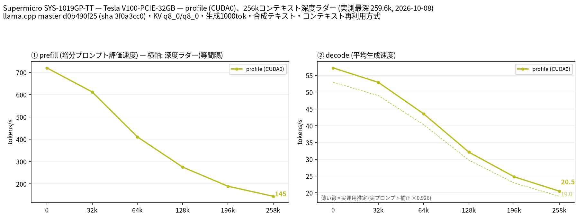

# Tesla V100-PCIE-32GB 1 枚で Qwen3.8 27B UD-Q4_K_M を 262k コンテキストまで計測

- **作成者**: sh1ma
- **作成日**: 2026-10-08

## 概要

1U サーバ Supermicro SYS-1019GP-TT に載せた Tesla V100-PCIE-32GB × 1 で、Qwen3.8-27B UD-Q4_K_M(MTP 投機的デコードあり)を `--profile` で 262k コンテキストまで計測しました。
decode は深さ 0 で 57.25 t/s、深さ約 260k で 20.49 t/s でした。新規プロンプトの prefill は約 720 t/s です。
最初の計測では、BMC のファン制御が GPU の温度に追従せず、GPU がサーマルスロットリングを起こしました。BMC のファンモードを Full にして取り直した値を載せています。

## ハードウェア

| 項目 | 内容 |
|------|------|
| コンピュータ / マザーボード | Supermicro SYS-1019GP-TT(マザーボード X11SPG-TF) |
| GPU | Tesla V100-PCIE-32GB × 1(VRAM 32 GB、nvidia-smi 表示は 32,768 MiB) |
| GPU 接続 | PCIe 3.0 x16。単一 GPU。GPU はパッシブ冷却で、筐体ファンの風で冷やす |
| CPU | Intel Xeon Gold 6126T(12 コア / 24 スレッド)× 1 |
| メモリ | 192 GB(Micron MTA36ASF4G72PZ-2G6H1R、32 GB DDR4-2666 ECC RDIMM × 6、2666 MT/s で動作) |
| GPU 電力上限 | 250 W(既定値。変更なし) |
| 冷却 | BMC のファンモード Full(8 ファンとも約 19,500〜21,500 RPM)。計測後に Optimal へ戻した |

GPU は画面表示に使っていません。計測ツールの GPU 計算プロセス検査では、計測サーバ以外のプロセスは検出されませんでした。

## ソフトウェア環境

| 項目 | 内容 |
|------|------|
| OS | Debian GNU/Linux 13 (trixie) / Linux 6.12.111+deb13-amd64 |
| GPU ドライバ | 550.163.01(Debian の `nvidia-driver` パッケージ。Volta は NVIDIA の 590 ブランチでサポート対象外になったため、それより前のドライバを使用) |
| llama.cpp | `0.6.0-dev`(build 11472、commit `d0b490f25edec147b4dcd69cce31c7d1099dff1d`)、CUDA バックエンド(`CMAKE_CUDA_ARCHITECTURES=70`)。CUDA 12.8.1 / GCC 14.2.0 でビルド。`llama-server` の sha256 は `3f0a3cc0e08d5775f67b1a267e21c58901ebdfd0b226eb00c00b41d23aca1097` |
| 作図 | Python 3.13.5 / matplotlib 3.11.2、Noto Sans CJK JP |

llama.cpp のソースは変更していません。ただし、Debian 13 の glibc 2.41 と CUDA 12.8 のヘッダで `cospi` / `cospif` / `sinpi` / `sinpif` の宣言が衝突してビルドできなかったため、CUDA の `math_functions.h` の該当 4 行に `noexcept (true)` を足しました(llama.cpp の `docs/build.md`「Fixing Compatibility Issues with Old CUDA and New glibc」の方法)。

## ベンチマーク

### 条件

| 項目 | 内容 |
|------|------|
| ツール | llama-split-bench `7af72d4085aa5073677d41389144112dd94fcb74`。計測・作図コードは未変更 |
| モデル | Qwen3.8-27B-UD-Q4_K_M.gguf([unsloth/Qwen3.8-27B-GGUF](https://huggingface.co/unsloth/Qwen3.8-27B-GGUF)、16,464,440,224 bytes、sha256 `322e194ff79741c7baa497c240f677f54b201b0efab44ca8e50f122b39123482`) |
| 測定モード | `profile`(CUDA0 のみ、単一構成) |
| ctx / stages | 262144 / 0,32000,64000,128000,196000,258000 |
| 生成長 | 各段 1,000 トークン |
| 新規入力 prefill | 目標 512 / 2048 / 8192 トークン、cache_prompt=false |
| KV キャッシュ | q8_0 / q8_0 |
| 投機的デコード | `--spec-type draft-mtp --spec-draft-n-max 2`(モデル本体の MTP ヘッドを使用) |
| Flash Attention / GPU 層数 | on / `-ngl all` |
| threads | 8 |
| その他 | `--cache-ram 8192 --cache-idle-slots --cache-reuse 256`(ツール既定)。Vision なし、mlock なし。実プロンプト補正あり |
| 実施回数 | smoke test 成功後、本測定 1 回(下記の冷却の問題で中断した 1 回目は除く) |

`bench.local.conf` で既定値から変えたのは `BIN`、`MODEL`、`DEVICES=CUDA0`、`MACHINE` だけです。

### 結果

単位は t/s(tokens/s)。「decode 実運用推定」は、実測 decode に実プロンプト補正係数 ×0.926 を掛けた値です。

| depth | 実際の深さ | prefill | decode | decode 実運用推定 | MTP 採択率 |
|------:|------:|------:|------:|------:|------:|
| 0 | 11 | 720.26 | 57.25 | 52.99 | 0.781 |
| 32000 | 32,093 | 612.46 | 52.93 | 48.99 | 0.997 |
| 64000 | 64,806 | 410.87 | 43.57 | 40.32 | 0.997 |
| 128000 | 128,788 | 275.43 | 32.13 | 29.74 | 1.0 |
| 196000 | 196,429 | 189.68 | 24.78 | 22.93 | 0.994 |
| 258000 | 259,601 | 144.66 | 20.49 | 18.97 | 0.998 |

depth 0 の prefill は、新規入力試験の `pp2048`(実入力 1,978 トークン)の値です(図と同じ)。ラダー初段の 11 トークン入力から出た prefill 値は表に載せていません。
depth 32000 以降の prefill は、その段で増えた分(32k〜68k トークン)を処理した速度です。

新規入力の prefill:

| 目標入力長 | 実入力長(prompt_n) | prefill(t/s) |
|------:|------:|------:|
| 512 | 512 | 693.33 |
| 2048 | 1,978 | 720.26 |
| 8192 | 8,077 | 721.58 |

実プロンプト(temperature 0.7、top_p 0.9、1,200 トークン生成)での decode:

| プロンプト | decode(t/s) | MTP 採択率 |
|------|------:|------:|
| design | 58.88 | 0.818 |
| review | 47.50 | 0.557 |
| qa | 52.58 | 0.675 |

- 計測時間は 10:31:39〜10:56:08(約 24.5 分。モデル起動・作図を含む)。
- 全段で入力長の縮小リトライはなく、各段とも 1,000 トークンを生成しました。
- VRAM 使用量はモデル起動後 27,252 MiB、ラダー中は最大 27,668 MiB でした(各段の前後の値)。
- 2 秒間隔の GPU サンプラでは、GPU 温度は最大 69°C、メモリ温度は最大 76°C でした。各段の終了時点の SM クロックは 1365〜1380 MHz(最大 1380 MHz)です。

### 所感

**冷却が結果を大きく左右しました。** 1 回目は BMC のファンモードが Optimal(ファン約 7,600 RPM)のまま計測しました。BMC のセンサーには GPU の温度が無く、GPU が熱くなってもファンが上がりません。そのため深い段で `SW Thermal Slowdown` が起き、SM クロックが 772〜1057 MHz まで落ちました。途中で中断したその回の値(添付なし)は次のとおりで、深さ 64k の decode は Full のときの 3 分の 1 程度でした。

| depth | decode(Optimal、スロットリングあり) | decode(Full、本報告) |
|------:|------:|------:|
| 0 | 57.26 | 57.25 |
| 32000 | 32.88 | 52.93 |
| 64000 | 15.68 | 43.57 |

1U サーバでパッシブ冷却の V100 を使う場合、長時間の負荷では BMC のファン設定を確認したほうがよいと分かりました。

それ以外の点:

- モデル全体と 262k の q8_0 KV キャッシュが 32 GB の VRAM に収まり、260k の深さでも decode 約 20 t/s を保ちました。
- 合成テキストでは MTP の採択率がほぼ 1.0 になるため、ラダーの decode は楽観側の値です。実プロンプトでは採択率 0.56〜0.82 で、補正係数は ×0.926 でした。
- 本測定は 1 回だけです。温度以外の要因(クロックのばらつきなど)は切り分けていません。

## 添付

- [run-info.json](attachment/2026-10-08_105734_profiling_qwen3.8_27b_ud_q4_k_m_up_to_262k_on_tesla_v100_pcie_32gb/run-info.json)
- [results-profile.json](attachment/2026-10-08_105734_profiling_qwen3.8_27b_ud_q4_k_m_up_to_262k_on_tesla_v100_pcie_32gb/results-profile.json)
- [results-profile-pp0.json](attachment/2026-10-08_105734_profiling_qwen3.8_27b_ud_q4_k_m_up_to_262k_on_tesla_v100_pcie_32gb/results-profile-pp0.json)
- [results-real.json](attachment/2026-10-08_105734_profiling_qwen3.8_27b_ud_q4_k_m_up_to_262k_on_tesla_v100_pcie_32gb/results-real.json)
- [argv-profile.txt](attachment/2026-10-08_105734_profiling_qwen3.8_27b_ud_q4_k_m_up_to_262k_on_tesla_v100_pcie_32gb/argv-profile.txt)
- [split-bench-en.png](attachment/2026-10-08_105734_profiling_qwen3.8_27b_ud_q4_k_m_up_to_262k_on_tesla_v100_pcie_32gb/split-bench-en.png)

公開用の `run-info.json` と `argv-profile.txt` では、ホームディレクトリのパスを `~/` に置き換えています。測定値・バイナリの sha256・モデル名は変更していません。
サーバログ、生成本文、GPU サンプラログ、モデル本体は添付していません。
