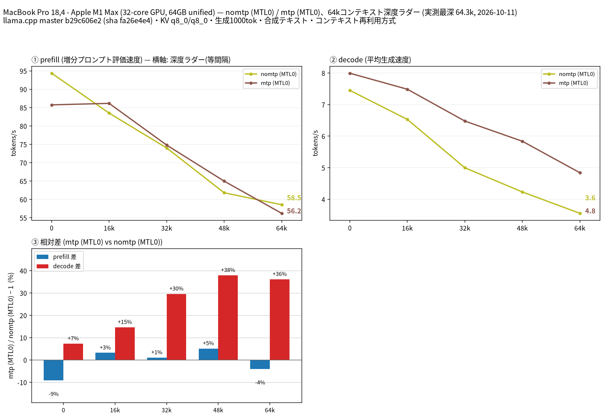

# Apple M1 Max 64GB で Qwen3.8 27B UD-Q4_K_M の MTP 投機的デコードを 64k まで比較

- **作成者**: Kenya Nara (@penta2himajin)
- **作成日**: 2026-10-11

## 概要

MacBook Pro 18,4(Apple M1 Max、32 コア GPU、ユニファイドメモリ 64 GB)の内蔵 GPU 1 基(Metal)で、Qwen3.8-27B-UD-Q4_K_M を 64k コンテキストまで計測し、モデル内蔵 MTP による投機的デコードの有無を比較しました。
decode は深さ 11 で 7.45 → 7.99 t/s、深さ約 48k で 4.23 → 5.84 t/s となり、深いほど MTP の効果が大きくなります(64k で +36%)。
一方 prefill は MTP ありのほうがわずかに遅く、新規入力 2,048 トークンでは 94.36 → 85.75 t/s でした。
この構成はメモリ帯域律速で、実測 decode 7.45 t/s は実効約 123 GB/s に相当します(M1 Max の公称帯域 400 GB/s の 3 割)。サーマルスロットリングやメモリ不足ではありません。

## ハードウェア

| 項目 | 内容 |
|------|------|
| コンピュータ / マザーボード | Apple MacBook Pro 18,4(型番 MacBookPro18,4、2021 年モデル) |
| GPU | Apple M1 Max(32 コア GPU、Metal 4)× 1(VRAM はユニファイドメモリと共通。計測中に Metal から見えていた空きは約 53 GB) |
| GPU 接続 | SoC 内蔵(GPU と CPU とメモリが同一パッケージ)。単一 GPU。NVLink 相当なし |
| CPU | Apple M1 Max(10 コア = 高性能 8 + 高効率 2) |
| メモリ | 64 GB LPDDR5(Hynix、512-bit、ユニファイドメモリ。GPU と共有。公称帯域 400 GB/s) |
| 電源 | 付属の AC アダプタで給電。計測中ずっと AC で、バッテリは 74〜81% で充電中だった |
| 冷却 | 内蔵ファン。`pmset -g therm` にサーマル警告・性能警告の記録なし |

内蔵ディスプレイ(Liquid Retina XDR)を使ったまま計測しています。GPU とメモリを共有するため、その負荷を完全には排除できていません。

## ソフトウェア環境

| 項目 | 内容 |
|------|------|
| OS | macOS 27.0.1(build 26A434)/ Darwin 27.0.0 |
| GPU ドライバ | OS 内蔵の Metal 4(別途ドライバなし) |
| llama.cpp | `0.4.1`(build 10964、commit `b29c606e2`)、Metal バックエンド。Homebrew のビルド済み `llama.cpp` をそのまま使用。`llama-server` の sha256 は `fa26e4e4490be1b9749ca2d58b53a1dcc1315983b0be2fdeeaea6d50ab247d7e` |
| 作図 | Python 3.14.7 / matplotlib 3.11.2、Noto Sans CJK JP |

llama.cpp のソースは変更していません。`llama-server --list-devices` では `BLAS: Accelerate` と `MTL0: Apple M1 Max` の 2 つが見え、計測は `MTL0` を使っています。

## ベンチマーク

### 条件

| 項目 | 内容 |
|------|------|
| ツール | llama-split-bench `7af72d4085aa5073677d41389144112dd94fcb74`。計測コードは未変更 |
| モデル | Qwen3.8-27B-UD-Q4_K_M.gguf([unsloth/Qwen3.8-27B-GGUF](https://huggingface.co/unsloth/Qwen3.8-27B-GGUF)、16,464,440,224 bytes = 15.33 GiB、sha256 `322e194ff79741c7baa497c240f677f54b201b0efab44ca8e50f122b39123482`) |
| 測定モード | `--mode-spec` による 2 アーム。`nomtp` = 投機的デコードなし、`mtp` = MTP あり。どちらも device は `MTL0`(内蔵 GPU が 1 基だけなので層分割・テンソル分割の比較はなし) |
| ctx / stages | 65536 / 0,16000,32000,48000,64000 |
| 生成長 | 各段 1,000 トークン |
| 新規入力 prefill | 目標 512 / 2048 / 8192 トークン、cache_prompt=false |
| KV キャッシュ | q8_0 / q8_0 |
| 投機的デコード | `mtp` アームのみ `--spec-type draft-mtp --spec-draft-n-max 2`。モデル本体に内蔵された MTP ヘッドを使い、外部ドラフトモデルは使っていない |
| Flash Attention / GPU 層数 | on / `-ngl all` |
| threads | 8 |
| その他 | `--cache-ram 8192 --cache-idle-slots --cache-reuse 256`(ツール既定)。Vision なし、mlock なし |
| 実施回数 | smoke test 成功後、本測定は各アーム 1 回 |

`bench.local.conf` で既定値から変えたのは `BIN`、`MODEL`、`DEVICES=MTL0`、`CTX`、`STAGES`、`MACHINE`、`LAUNCH_PREFIX` です。2 アームは同じタグ(`m1max-27b-64k`)に対して `run-bench.sh` を 2 回実行して取得しました(`--reuse` で追記)。

macOS 固有の差分が 2 点ありました。どちらも計測値には影響しません。

1. `run-bench.sh` の起動引数組み立ては空の配列を `"${PREFIX[@]}"` として展開しますが、`/bin/bash` 3.2 は `set -u` の下でこれを `unbound variable` として落とします(実測)。`LAUNCH_PREFIX="env"` を設定して配列を空にしないことで回避しました。
2. スクリプト末尾の `SERIES_NAMES=$(... | paste -sd,)` は BSD の `paste` がファイル引数なしの `-s` を受け付けず失敗します(実測: `usage: paste [-s] [-d delimiters] file ...`)。このため自動作図だけが失敗し、実行は `BENCH-FIGFAIL` で終わります。計測自体は完走するので、`plot_bench.py` を同じ引数で手動実行して図を作りました。

### 結果

単位は t/s。図の系列名 `nomtp (MTL0)` が投機的デコードなし、`mtp (MTL0)` が MTP ありです。「decode 実運用推定」は `mtp` の実測 decode に実プロンプト補正係数 ×0.634 を掛けた値です。

| depth | 実際の深さ | prefill(MTP なし) | decode(MTP なし) | prefill(MTP) | decode(MTP) | decode 実運用推定 | MTP 採択率 |
|------:|------:|------:|------:|------:|------:|------:|------:|
| 0 | 11 | 94.36 | 7.45 | 85.75 | 7.99 | 5.07 | 0.965 |
| 16000 | 15,825 | 83.49 | 6.53 | 86.15 | 7.49 | 4.75 | 0.997 |
| 32000 | 32,458 | 74.02 | 5.00 | 74.80 | 6.48 | 4.11 | 0.997 |
| 48000 | 48,387 | 61.82 | 4.23 | 64.98 | 5.84 | 3.70 | 0.997 |
| 64000 | 64,259 | 58.55 | 3.56 | 56.21 | 4.84 | 3.07 | 0.997 |

depth 0 の prefill は、新規入力試験の `pp2048`(実入力 1,978 トークン)の値です(図と同じ)。ラダー初段の 11 トークン入力から出た prefill 値(なし 20.14 / MTP あり 20.75)は測定アーティファクトのため表に載せていません。
depth 16000 以降の prefill は、その段で増えた分(16k〜64k トークン)を処理した速度です。

新規入力の prefill:

| 目標入力長 | 実入力長(prompt_n) | MTP なし(t/s) | MTP あり(t/s) |
|------:|------:|------:|------:|
| 512 | 512 | 94.58 | 77.93 |
| 2048 | 1,978 | 94.36 | 85.75 |
| 8192 | 8,077 | 92.33 | 78.20 |

実プロンプト(temperature 0.7、top_p 0.9、1,200 トークン生成)での decode。実プロンプト計測は `mtp` アームだけで実施しています:

| プロンプト | prefill(t/s) | decode(t/s) | MTP 採択率 |
|------|------:|------:|------:|
| design | 54.41 | 6.06 | 0.801 |
| review | 54.50 | 4.57 | 0.563 |
| qa | 35.67 | 4.58 | 0.642 |

- `nomtp` は 11:36:15〜12:11:35(35 分 20 秒)、`mtp` は 12:12:11〜12:56:18(44 分 7 秒)。モデル起動時間と手動での作図を含みます。
- 全段で入力長の縮小リトライはなく、各段とも 1,000 トークンを生成しました。
- `pmset -g therm` を 30 秒間隔で記録しましたが、サーマル警告・性能警告は一度も記録されませんでした(`nomtp` 167 回、`mtp` 94 回のサンプル)。

### 所感

**この構成ではメモリ帯域が上限を決めています。** モデルは 16.46 GB あり、dense モデルは 1 トークン生成するたびにこの重みを全部読みます。実測 decode 7.45 t/s は実効 123 GB/s に相当し、公称 400 GB/s の 3 割です。深さ 64k では KV キャッシュの読み出しも加わるため、実効はさらに下がります(3.56 t/s で約 73 GB/s)。
参考までに、同じモデル・同じ量子化を Tesla V100-PCIE-32GB 1 枚(`--profile`)で測った既存レポートでは、depth 0 の decode が 57.25 t/s でした。帯域あたりの効率は別として、dense 27B をラップトップの内蔵 GPU で回す場合、この 1 桁台の decode が現実的な値です。

**MTP は深いほど効きます。** 深さ 11 では +7% ですが、32k で +30%、48k で +38%、64k で +36% です。合成本文での採択率は深さ 16k 以降 0.997 とほぼ上限に張り付いており、1 サイクルで複数トークンを出す効果がそのまま出ています。深い領域では decode が帯域律速になり 1 トークンあたりの重み読み出しの相対コストが増えるため、MTP の効きが大きくなると解釈しています。

**MTP は prefill を少し遅くします。** 新規入力の prefill は pp512 で 94.58 → 77.93(−18%)、pp8192 で 92.33 → 78.20(−15%)、ラダーの 64k の段で 58.55 → 56.21(−4%)でした。ドラフト生成ぶんのオーバーヘッドが出ています。深さ 16k〜48k では逆にわずかに速い(+1〜5%)ので、この差は測定ばらつきの範囲と見ています。

**実プロンプトでは採択率が下がります。** 合成テキストの 0.997 に対し、実プロンプト 3 本では 0.563〜0.801 で、補正係数は ×0.634 でした。したがって実運用の decode は深さ 64k で 3.07 t/s 程度になります。`nomtp` アームでは実プロンプト計測を行っていないため、両アームの実運用値は比較できていません。

限界と注意:

- 本測定は各アーム 1 回です。クロックや周囲温度によるばらつきは切り分けていません。
- 実プロンプト補正係数は深さ 60 トークン前後の短いプロンプトで測った値です。深い depth にそのまま当てはめられる保証はありません(V100 の既存レポートと同じ扱いにしています)。
- 内蔵ディスプレイを使ったままで計測しました。GPU とメモリを共有するため、影響を完全には排除できていません。

## 添付

- [run-info.json](attachment/2026-10-11_125828_comparing_mtp_speculative_decoding_of_qwen3.8_27b_up_to_64k_on_apple_m1_max/run-info.json)
- [results-nomtp.json](attachment/2026-10-11_125828_comparing_mtp_speculative_decoding_of_qwen3.8_27b_up_to_64k_on_apple_m1_max/results-nomtp.json)
- [results-mtp.json](attachment/2026-10-11_125828_comparing_mtp_speculative_decoding_of_qwen3.8_27b_up_to_64k_on_apple_m1_max/results-mtp.json)
- [results-nomtp-pp0.json](attachment/2026-10-11_125828_comparing_mtp_speculative_decoding_of_qwen3.8_27b_up_to_64k_on_apple_m1_max/results-nomtp-pp0.json)
- [results-mtp-pp0.json](attachment/2026-10-11_125828_comparing_mtp_speculative_decoding_of_qwen3.8_27b_up_to_64k_on_apple_m1_max/results-mtp-pp0.json)
- [results-real.json](attachment/2026-10-11_125828_comparing_mtp_speculative_decoding_of_qwen3.8_27b_up_to_64k_on_apple_m1_max/results-real.json)
- [argv-nomtp.txt](attachment/2026-10-11_125828_comparing_mtp_speculative_decoding_of_qwen3.8_27b_up_to_64k_on_apple_m1_max/argv-nomtp.txt)
- [argv-mtp.txt](attachment/2026-10-11_125828_comparing_mtp_speculative_decoding_of_qwen3.8_27b_up_to_64k_on_apple_m1_max/argv-mtp.txt)
- [split-bench-en.png](attachment/2026-10-11_125828_comparing_mtp_speculative_decoding_of_qwen3.8_27b_up_to_64k_on_apple_m1_max/split-bench-en.png)

公開用の `run-info.json` は、同じタグに対して 2 回実行したため `modes` が最後のアーム(`mtp`)だけになっていたのを、2 アーム分(`nomtp`、`mtp`)に統合しています。`argv-*.txt` とあわせて、ホームディレクトリのパスを `~/` に置き換えました。測定値・バイナリの sha256・モデル名は変更していません。
サーバログ、生成本文、モデル本体は添付していません。
